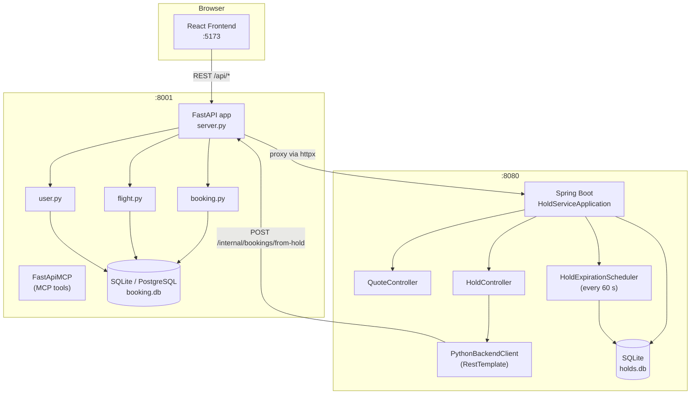
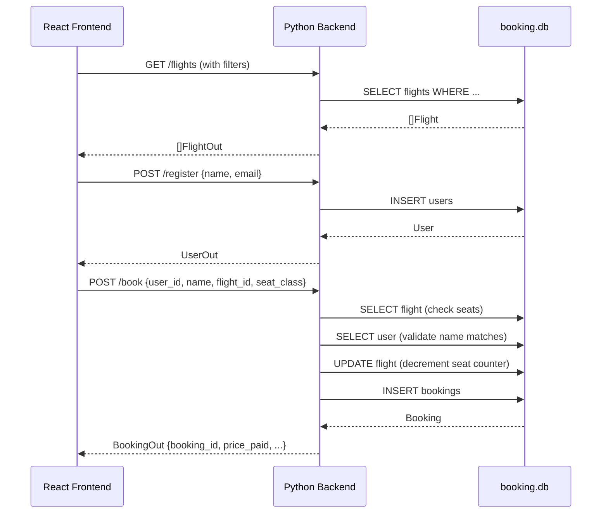
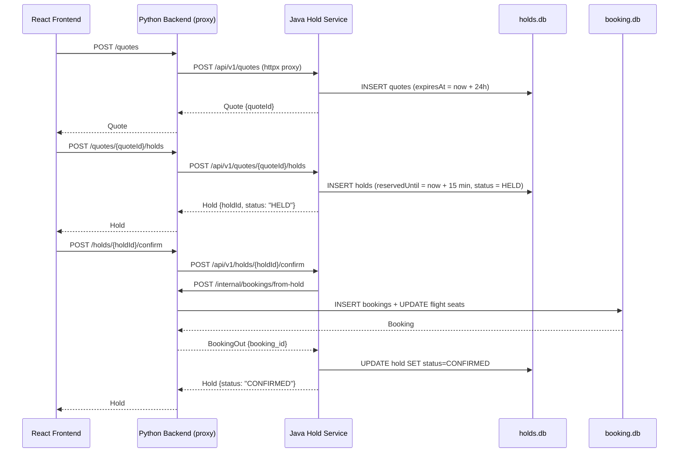

# Galaxium Travels — Contributor Onboarding Guide

> **Audience:** Beginner contributors — first open-source contribution or first polyglot codebase.  
> **Level guidance:** Each section emphasises which files to read first and what concepts to look up before starting work.  
> **Evidence policy:** Every claim traces to a repository file or one of the four detailed onboarding documents under `docs/onboarding/`. Nothing is invented.

---

## Table of Contents

1. [Project Overview](#1-project-overview)
2. [Architecture Summary](#2-architecture-summary)
3. [Services and Responsibilities](#3-services-and-responsibilities)
4. [Main Application Flows](#4-main-application-flows)
5. [Local Development Prerequisites](#5-local-development-prerequisites)
6. [Environment Variables](#6-environment-variables)
7. [Installation and Setup](#7-installation-and-setup)
8. [Build, Test, Lint, and Run](#8-build-test-lint-and-run)
9. [Known Setup Failures and Limitations](#9-known-setup-failures-and-limitations)
10. [Documentation Drift to Know About](#10-documentation-drift-to-know-about)
11. [Starter Tasks](#11-starter-tasks)
12. [Next Steps and Useful References](#12-next-steps-and-useful-references)

---

## 1. Project Overview

**Galaxium Travels** is a demo interplanetary flight-booking application. Its purpose is to showcase the challenges that AI coding agents face inside a realistic multi-service codebase — competing service boundaries, divergent databases, non-trivial error-handling conventions, and stale documentation.

It is not intended for production use. All prices are in credits; all flights depart in 2099.

The project consists of three independently runnable services:

| Service | Stack | Port |
|---|---|---|
| Python Backend | Python 3 / FastAPI / SQLite | 8001 |
| Java Hold Service | Java 17–21 / Spring Boot 3.4.1 / SQLite | 8080 |
| React Frontend | React 19 / TypeScript / Vite | 5173 |

Source: [`README.md`](README.md), [`docs/onboarding/architecture.md`](docs/onboarding/architecture.md).

> 📁 **Where to start reading:** [`README.md`](README.md) for a high-level orientation, then [`AGENTS.md`](AGENTS.md) for the non-obvious patterns and footguns that affect all contributors.

---

## 2. Architecture Summary

The three services have clear responsibilities and communicate over HTTP:



**Key runtime boundaries to understand:**

- The **frontend** never talks to the Java service directly — all calls go through the Python backend, which acts as a proxy for hold/quote routes.
- The **Java service** calls back to Python (`POST /internal/bookings/from-hold`) when a hold is confirmed. This is the only time Java initiates a request to Python.
- Both services have their own SQLite database files (`booking.db` and `holds.db`) committed to the repository as seed artefacts — do not delete them.

Source: [`docs/onboarding/architecture.md §3`](docs/onboarding/architecture.md).

---

## 3. Services and Responsibilities

### Python Backend (`booking_system_backend/`)

Entry point: [`server.py`](booking_system_backend/server.py). The `FastAPI` app is created at line 44; `FastApiMCP(app)` wraps it at line 336 (after all routes). Port: **8001**. Database: SQLite (`booking.db`) by default, PostgreSQL when `DATABASE_URL` is set.

This service handles user registration, flight search, direct seat bookings, booking cancellations, and all hold/quote proxy routes to the Java service. It also exposes an MCP server — `FastApiMCP` auto-generates one MCP tool per FastAPI route (14 tools total).

Core modules: [`db.py`](booking_system_backend/db.py) (SQLAlchemy engine), [`models.py`](booking_system_backend/models.py) (ORM), [`schemas.py`](booking_system_backend/schemas.py) (Pydantic), [`services/booking.py`](booking_system_backend/services/booking.py), [`services/flight.py`](booking_system_backend/services/flight.py), [`services/user.py`](booking_system_backend/services/user.py).

> 📁 **Files to read first:** [`server.py`](booking_system_backend/server.py) lines 1–70 (imports and app setup), then [`services/booking.py`](booking_system_backend/services/booking.py) (most logic lives here).

### Java Hold Service (`booking_system_inventory_hold_service/`)

Entry point: [`HoldServiceApplication.java`](booking_system_inventory_hold_service/src/main/java/com/galaxium/holdservice/HoldServiceApplication.java). Port: **8080**. Database: SQLite (`holds.db`), schema managed by Hibernate `ddl-auto=update`.

This service owns the quote and hold lifecycle. A quote locks in a price for 24 hours. A hold reserves a seat for 15 minutes and can be confirmed (creating a real booking via Python callback), released, or left to expire. A background scheduler runs every 60 seconds to expire stale holds.

Requires **Java 17 or 21** — Lombok 1.18.36 does not support Java 22+.

> 📁 **Files to read first:** [`application.properties`](booking_system_inventory_hold_service/src/main/resources/application.properties) (config), [`HoldController.java`](booking_system_inventory_hold_service/src/main/java/com/galaxium/holdservice/api/HoldController.java) (routes), [`HoldService.java`](booking_system_inventory_hold_service/src/main/java/com/galaxium/holdservice/service/HoldService.java) (business logic).

### React Frontend (`booking_system_frontend/`)

Dev server port: **5173**. Stack: React 19.2.0 / TypeScript / Vite / Tailwind CSS.

Pages: `Home`, `Flights`, `MyBookings`, `DestinationDetail`. All backend calls go through [`src/services/api.ts`](booking_system_frontend/src/services/api.ts) — an axios wrapper that normalises errors to a consistent shape. The API base URL is controlled by the `VITE_API_URL` env var (default `/api`, proxied by Vite to `http://localhost:8001` in dev).

> 📁 **Files to read first:** [`src/services/api.ts`](booking_system_frontend/src/services/api.ts) (understand how API errors are handled before writing frontend code), then [`src/pages/Flights.tsx`](booking_system_frontend/src/pages/Flights.tsx).

Source: [`docs/onboarding/architecture.md §2`](docs/onboarding/architecture.md).

---

## 4. Main Application Flows

### Flow 1 — Direct Booking (no Java involvement)

The simplest path. The frontend calls the Python backend only.



**Non-obvious:** `POST /book` validates **both** `user_id` AND `name`. A name mismatch returns a `NAME_MISMATCH` error even if the `user_id` is valid. This is intentional security behaviour. See [`services/booking.py:51–65`](booking_system_backend/services/booking.py:51).

### Flow 2 — Hold-Based Booking (cross-service)

Seat inventory is only decremented at confirmation. The Java service owns quote/hold state; Python owns actual seat inventory.



**Non-obvious:** Python proxy routes catch `httpx.HTTPError` and return `{"error": "..."}` with **HTTP 200** — not a 4xx/5xx. Frontend and test code must inspect the response body, not just the HTTP status.

Source: [`docs/onboarding/architecture.md §6`](docs/onboarding/architecture.md).

---

## 5. Local Development Prerequisites

> Source: [`docs/onboarding/verified-setup.md §1`](docs/onboarding/verified-setup.md). These requirements were verified (or confirmed absent) by actually running commands on a Windows 10 x64 machine.

| Runtime | Required version | Notes |
|---|---|---|
| **Python** | 3.8+ | Use the official installer from [python.org](https://python.org) or `winget install Python.Python.3.11`. Do **not** use Microsoft Store Python stubs — they open the Store when invoked instead of running Python. |
| **Node.js** | 18+ | Required for the React frontend only. Install with `winget install OpenJS.NodeJS.LTS`. |
| **npm** | bundled with Node | Comes with Node.js. |
| **Java** | **17 or 21 exactly** | Lombok 1.18.36 (used throughout the Java service) does not support Java 22+. Java 23 was present on the verification machine and is **incompatible**. Install Adoptium Temurin 21: `winget install EclipseAdoptium.Temurin.21.JDK`. |
| **Maven** | 3.6+ | Required to build and run the Java service. Install with `winget install Apache.Maven`. |
| **Docker** | Latest | Required for `docker compose up` and all e2e tests. On macOS, [Colima](https://github.com/abiosoft/colima) is recommended. |
| **Git** | Any recent | Standard version control. |

**Platform notes:**

- **Windows:** Use PowerShell. The e2e native runner (`./e2e/run-native.sh`) requires bash — use Git Bash, WSL, or the Docker path instead.
- **macOS:** Install Docker BuildX alongside Colima (see [`AGENTS.md`](AGENTS.md) Prerequisites section for the exact `~/.docker/config.json` setup required).
- **All platforms:** After installing Java 21, set `JAVA_HOME` to point to the new JDK if the system still picks up a different version.

---

## 6. Environment Variables

> Source: [`docs/onboarding/architecture.md §7`](docs/onboarding/architecture.md), [`docs/onboarding/verified-setup.md §2`](docs/onboarding/verified-setup.md).

### Python Backend

| Variable | Default | Service | Notes |
|---|---|---|---|
| `DATABASE_URL` | `sqlite:///./booking.db` | Python | Set to a PostgreSQL URL for Docker Compose. Unset → SQLite. |
| `SEED_DEMO_DATA` | `true` | Python | Calls `seed()` on startup — but `seed()` only runs when the DB is empty. Does **not** overwrite existing data. |
| `JAVA_SERVICE_URL` | `http://localhost:8080` | Python | URL of the Java hold service. Must match Java's actual port. |
| `CORS_ORIGINS` | `*` | Python | Comma-separated list of allowed CORS origins. |

### Java Hold Service

| Variable | Default | Service | Notes |
|---|---|---|---|
| `PYTHON_BACKEND_URL` | `http://localhost:8001` | Java | URL the Java service uses to call back to Python. **Must be 8001, not 8000** — the Java README incorrectly states 8000 in several places. |
| `HOLD_DURATION_MINUTES` | `15` | Java | How long a hold reservation is valid. |
| `HOLD_EXPIRATION_CHECK_INTERVAL_SECONDS` | `60` | Java | How often the expiry scheduler runs. |
| `SPRING_DATASOURCE_URL` | `jdbc:sqlite:./holds.db` | Java | SQLite path for the Java service database. |

### Frontend

| Variable | Default | Service | Notes |
|---|---|---|---|
| `VITE_API_URL` | `/api` | Frontend | Backend base URL. In dev, Vite proxies `/api` to `http://localhost:8001`. For Docker, set to `http://localhost:8001`. |

---

## 7. Installation and Setup

> Each command's verification status is sourced from [`docs/onboarding/verified-setup.md §3`](docs/onboarding/verified-setup.md).

### Python Backend

```powershell
# Working directory: booking_system_backend/

# Step 1 — Create virtual environment
py -m venv .venv                     # Windows with official Python installer
# or: python3 -m venv .venv          # macOS/Linux

# Step 2 — Install dependencies
.\.venv\Scripts\python.exe -m pip install -r requirements.txt   # Windows
# or: .venv/bin/pip install -r requirements.txt                  # macOS/Linux
```

| Step | Status |
|---|---|
| Create venv | ✅ **Verified** — succeeded on Windows 10 with Python 3.11.10 |
| pip install | ✅ **Verified** — all packages installed; see §9 for known incompatibility |

> ⚠️ **After install:** `ruff` and `mypy` are **not** in `requirements.txt`. Install them separately if you need lint or type-check: `pip install ruff mypy`

### React Frontend

```bash
# Working directory: booking_system_frontend/
npm install
```

| Step | Status |
|---|---|
| npm install | ❌ **Not executed** — Node.js not installed on the verification machine. Expected to succeed once Node 18+ is installed. |

### Java Hold Service

```bash
# Working directory: booking_system_inventory_hold_service/
mvn clean package -DskipTests   # or: mvn spring-boot:run (run directly)
```

| Step | Status |
|---|---|
| mvn build | ❌ **Not executed** — two blockers: Maven not on PATH; Java 23 is incompatible with Lombok. |

---

## 8. Build, Test, Lint, and Run

> Source: [`docs/onboarding/verified-setup.md §4–6`](docs/onboarding/verified-setup.md).

### Python Backend — Tests

```powershell
# Working directory: booking_system_backend/

# Service layer tests only (fast, no server import needed)
.\.venv\Scripts\python.exe -m pytest tests/test_services.py -v --tb=short
# ✅ VERIFIED — 37/37 PASSED in 0.31 s

# Full suite (requires fastapi-mcp/mcp fix — see §9)
.\.venv\Scripts\python.exe -m pytest -v --tb=short
# ❌ CURRENTLY FAILS — 35 errors in test_rest.py (mcp incompatibility); 37 pass
```

**Critical:** pytest **must be run from inside `booking_system_backend/`**, not the repo root. `conftest.py` sets up `sys.path` relative to its own location and imports will break from any other directory.

### Python Backend — Lint and Type-check

```powershell
# Working directory: booking_system_backend/
# (install ruff and mypy first: pip install ruff mypy)

.\.venv\Scripts\ruff.exe check .                        # ✅ VERIFIED — All checks passed!
.\.venv\Scripts\mypy.exe . --ignore-missing-imports     # ✅ VERIFIED — no new errors
```

The mypy run reports 40 errors, but all 40 are pre-existing entries in [`.bob/hooks/mypy-baseline.txt`](booking_system_backend/.bob/hooks/mypy-baseline.txt). Only errors **not** in that baseline are actionable.

### Python Backend — Run

```powershell
# Working directory: booking_system_backend/
.\.venv\Scripts\python.exe server.py
# ❌ CURRENTLY FAILS — blocked by fastapi-mcp/mcp incompatibility (see §9)
# Expected (after fix): Uvicorn on http://0.0.0.0:8001
```

### Frontend — Lint and Build

```bash
# Working directory: booking_system_frontend/
npm run lint     # ESLint — no frontend unit tests exist
npm run build    # tsc -b && vite build
# ❌ UNTESTED — Node.js not installed on the verification machine
```

### Frontend — Dev Server

```bash
npm run dev      # listens on :5173
# ❌ UNTESTED — Node.js not installed on the verification machine
```

### Java Hold Service — Tests and Run

```bash
# Working directory: booking_system_inventory_hold_service/
mvn test -q            # unit tests
mvn spring-boot:run    # dev run on :8080
# ❌ UNTESTED — Maven not on PATH; Java 23 incompatible with Lombok
```

### Full Stack (one command)

```bash
./start.sh    # wraps scripts/local/start_locally.sh — starts backend → Java → frontend
# ❌ UNTESTED — requires bash, Java 17/21, Maven, Node.js
```

### Docker Compose

```bash
docker compose up                           # backend + frontend + PostgreSQL
docker compose --profile hold-service up   # + Java hold service
# ❌ UNTESTED — Docker not installed on the verification machine
```

> ⚠️ The Java service is **behind a profile** in [`docker-compose.yml`](docker-compose.yml) and must be opted in with `--profile hold-service`.

### e2e Tests

```bash
./e2e/run-native.sh              # manages its own service lifecycle
E2E_RUN_SLOW=1 ./e2e/run-native.sh   # includes ~90 s auto-expiry test
# ❌ UNTESTED — requires bash, Java 17/21, Maven on PATH
```

---

## 9. Known Setup Failures and Limitations

> Source: [`docs/onboarding/verified-setup.md §8–9`](docs/onboarding/verified-setup.md).

### ❌ Critical — `fastapi-mcp` / `mcp` version incompatibility

**Affects:** `python server.py` startup, all 35 tests in `test_rest.py`  
**Reproduces on:** fresh `pip install -r requirements.txt` — no version pins in `requirements.txt`

**Exact error:**
```
server.py:336: mcp = FastApiMCP(app)
fastapi_mcp/server.py:144: mcp_server = Server(self.name, self.description)
TypeError: Server.__init__() takes 2 positional arguments but 3 were given
```

**Root cause:** `mcp 2.2.0` changed `Server.__init__()` to accept only `name`; `fastapi-mcp 0.4.0` still passes `name` and `description`. The resolver picks the latest of both, landing on the incompatible pair.

**Fix (not applied — this is a docs-only session):** Pin a compatible pair in `requirements.txt`:
```
fastapi-mcp==0.4.0
mcp==1.9.4
```
See [Starter Task 1](#task-1----pin-fastapi-mcp-and-mcp-in-requirementstxt) for the full verification procedure.

---

### ❌ Node.js not installed (Blocks frontend)

**Affects:** `npm install`, `npm run lint`, `npm run build`, `npm run dev`

**Fix:** `winget install OpenJS.NodeJS.LTS` then restart the shell.

---

### ❌ Java 23 / Maven not on PATH (Blocks Java service)

**Affects:** `mvn test`, `mvn spring-boot:run`, all e2e tests

**Root cause:** Lombok 1.18.36 does not support annotation processing on Java 22+. Maven PATH entries on the verification machine point to non-existent directories.

**Fix:**
```powershell
winget install EclipseAdoptium.Temurin.21.JDK
winget install Apache.Maven
# Set JAVA_HOME to the new JDK directory, then restart the shell
```

---

### ⚠️ `ruff` and `mypy` missing from `requirements.txt`

Both tools are documented in [`AGENTS.md`](AGENTS.md) but absent from `requirements.txt`. Install separately:
```
pip install ruff mypy
```
See [Starter Task 2](#task-2----add-ruff-and-mypy-to-requirementstxt).

---

### ⚠️ Untested steps (environment blockers)

| Step | Reason untested |
|---|---|
| `npm install`, `npm run lint`, `npm run build`, `npm run dev` | Node.js not installed |
| `mvn test`, `mvn spring-boot:run` | Maven not on PATH; Java 23 incompatible |
| `./start.sh` | Requires bash, Java 17/21, Maven, Node.js |
| `docker compose up` | Docker not installed |
| `./e2e/run-native.sh` | Requires bash, Java 17/21, Maven |
| `./scripts/aws/deploy-to-aws.sh` | Requires AWS CLI, Terraform, Docker |
| `./scripts/ibm/deploy-to-ibm.sh` | Requires IBM Cloud CLI, Code Engine plugin, Docker |

---

## 10. Documentation Drift to Know About

> Source: [`docs/onboarding/docs-drift-report.md`](docs/onboarding/docs-drift-report.md).  
> **52 claims checked across 9 docs — 24 drifted (46%).** Read this table before trusting existing documentation.

### 🔴 High Impact — Will mislead developers

| ID | Source | Wrong claim | Correct value |
|---|---|---|---|
| C-01/C-02 | `booking_system_backend/README.md` | Backend port is **8080** | Native port is **8001** |
| C-09/C-10/C-11 | `booking_system_inventory_hold_service/README.md` | Python backend URL default is `localhost:**8000**` | Default is `localhost:**8001**` (three places in the file) |
| C-12/C-15 | Hold-service `README.md` + `spec.md` | Internal callback path is `/api/internal/bookings/from-hold` | Actual path is `/internal/bookings/from-hold` (no `/api`) |
| C-42 | `AGENTS.md` line 19 | `FastMCP` at line 22 before `FastAPI` | `FastAPI` at line 44, `FastApiMCP` at line 336 — FastAPI is first |
| C-30 | `AGENTS.md` line 25 | conftest patches `db.SessionLocal` + `server.SessionLocal` | Uses `app.dependency_overrides[get_db]` (FastAPI DI) — no `SessionLocal` patching |

### 🟡 Medium Impact — Wrong version or count

| ID | Source | Wrong claim | Correct value |
|---|---|---|---|
| C-08 | Hold-service `README.md` | Spring Boot 3.2.0 | Spring Boot **3.4.1** (`pom.xml:19`) |
| C-19/C-20 | Frontend `README.md` | React 18, React Router v6 | React **19.2.0**, React Router **v7.12.0** |
| C-25 | Root `README.md` | **6** MCP tools | **14** tools — one per FastAPI route (FastApiMCP auto-generates) |
| C-26 | `AGENTS.md` | `SEED_DEMO_DATA=true` re-seeds every start | Guarded by `User.count() == 0` — never overwrites data |
| C-22 | Frontend `README.md` | Pages: Home, Flights, MyBookings | Also includes `DestinationDetail.tsx` |

### 🟢 Low Impact — Missing files or path discrepancies

| ID | Source | Issue |
|---|---|---|
| C-03/C-04 | Backend `README.md` | Install path shown as `cd booking_system`; directory is `booking_system_backend/` |
| C-37/C-38 | `scripts/README.md` | References `deploy-aws.sh`, `deploy-ibm.sh` wrappers and two deployment docs — none exist |
| C-39 | Root `README.md` | References `DEMO_RUNBOOK.md` — file does not exist |
| C-34 | `AGENTS.md` | e2e docker-compose described as running Postgres — it is SQLite-only |

---

## 11. Starter Tasks

> Source: [`docs/onboarding/starter-tasks.md`](docs/onboarding/starter-tasks.md).  
> Ranked for a **beginner** contributor: self-contained, low-risk, architecturally legible, level-appropriate.  
> No issue-tracker MCP is configured — all tasks are grounded in repository evidence only. Zero TODO/FIXME comments were found in any source file.

---

### Task 1 — Pin `fastapi-mcp` and `mcp` in `requirements.txt`

**Rank:** ⭐ 1 of 5 | **Files:** [`booking_system_backend/requirements.txt`](booking_system_backend/requirements.txt)

**What is broken:** Fresh `pip install -r requirements.txt` resolves `fastapi-mcp==0.4.0` + `mcp==2.2.0` — an incompatible pair. `mcp 2.2.0` changed `Server.__init__()` to accept one argument; `fastapi-mcp 0.4.0` passes two. Result: 35/72 backend tests error at collection, and `python server.py` fails at import.

**What to change:** Add explicit version pins for `fastapi-mcp` and `mcp` to `requirements.txt`. One confirmed-compatible option: `fastapi-mcp==0.4.0` + `mcp==1.9.4`.

**Files to read first:**
1. [`booking_system_backend/requirements.txt`](booking_system_backend/requirements.txt) — understand the current unpinned format
2. [`booking_system_backend/server.py:336`](booking_system_backend/server.py:336) — this is the one line that calls `FastApiMCP(app)`; the crash happens here at import time

**Concepts to look up before starting:**
- Python version pinning: `package==x.y.z` (exact) vs `package>=x,<y` (range)
- How `pip` resolves dependency versions (latest compatible by default when unpinned)

**Verify the fix:**
```powershell
cd booking_system_backend
.\.venv\Scripts\python.exe -m pip install -r requirements.txt --upgrade
.\.venv\Scripts\python.exe -m pytest -v --tb=short
# Expected: 72 passed, 0 errors
```

**Suitability:** Entire fix is one text file. Cannot break the 37 tests that currently pass. Unblocks server startup and 35 failing tests.

**Risk:** Research the correct pin yourself — verify on PyPI before committing. If upgrading `fastapi-mcp` instead of pinning `mcp` down, confirm the `FastApiMCP(app)` call signature is unchanged.

---

### Task 2 — Add `ruff` and `mypy` to `requirements.txt`

**Rank:** 2 of 5 | **Files:** [`booking_system_backend/requirements.txt`](booking_system_backend/requirements.txt)

**What is broken:** [`AGENTS.md`](AGENTS.md) documents `ruff check .` and `mypy . --ignore-missing-imports` as standard development commands. Neither tool is in `requirements.txt`. After a standard install, both are absent from the venv.

**What to change:** Add `ruff` and `mypy` to `requirements.txt` (or a new `requirements-dev.txt`).

**Files to read first:**
1. [`booking_system_backend/requirements.txt`](booking_system_backend/requirements.txt) — understand what's currently there
2. [`booking_system_backend/ruff.toml`](booking_system_backend/ruff.toml) — ruff config (ignores B008 for FastAPI `Depends()` patterns)

**Concepts to look up before starting:**
- Difference between runtime and dev dependencies in Python projects
- What `ruff` and `mypy` do (linting vs. type checking)

**Verify the fix:**
```powershell
cd booking_system_backend
.\.venv\Scripts\python.exe -m pip install -r requirements.txt
.\.venv\Scripts\ruff.exe check .                       # → All checks passed!
.\.venv\Scripts\mypy.exe . --ignore-missing-imports    # → only baseline errors
```

**Suitability:** One or two line additions. Zero runtime effect. No architectural knowledge required.

**Risk:** If using `requirements-dev.txt`, also update the install instructions in [`AGENTS.md`](AGENTS.md). This task pairs naturally with Task 1 (same file).

---

### Task 3 — Fix three incorrect footgun claims in `AGENTS.md`

**Rank:** 3 of 5 | **Files:** [`AGENTS.md`](AGENTS.md)

**What is wrong:** Three "Footguns" bullets in `AGENTS.md` contain factually incorrect claims:

| AGENTS.md line | Wrong claim | Correct |
|---|---|---|
| ~line 19 | `FastMCP` at server.py line 22 before `FastAPI` | `FastAPI` at line 44; `FastApiMCP(app)` at line 336 |
| ~line 25 | conftest patches `db.SessionLocal` + `server.SessionLocal` | Uses `app.dependency_overrides[get_db]` (FastAPI DI) |
| ~line 24 | `SEED_DEMO_DATA=true` re-seeds every start | `seed()` is guarded by `User.count() == 0`; never overwrites |

**Files to read first (verify the corrections yourself):**
1. [`booking_system_backend/server.py:44`](booking_system_backend/server.py:44) and [`server.py:336`](booking_system_backend/server.py:336) — confirm FastAPI at 44, FastApiMCP at 336
2. [`booking_system_backend/tests/conftest.py:49–60`](booking_system_backend/tests/conftest.py:49) — confirm `dependency_overrides`
3. [`booking_system_backend/seed.py:13–20`](booking_system_backend/seed.py:13) — confirm `count() > 0` guard

**Concepts to look up before starting:**
- FastAPI `dependency_overrides` — how it replaces `get_db` during tests without patching globals
- Python `if db.query(Model).count() > 0: return` as a guard pattern

**Suitability:** All three corrections in one Markdown file. Reviewing the source first (3 × ~10 lines) is the entire skill being practised. A wrong correction is easily caught in review.

**Risk:** Preserve the *intent* of the C-42 warning — order matters for FastAPI lifespan composition, even though the description and line number were wrong. Do not remove the caution; correct it.

---

### Task 4 — Fix port and version errors in `booking_system_inventory_hold_service/README.md`

**Rank:** 4 of 5 | **Files:** [`booking_system_inventory_hold_service/README.md`](booking_system_inventory_hold_service/README.md)

**What is wrong:** Four stale values that will mislead a developer running the Java service standalone:

| Location | Wrong | Correct | Evidence |
|---|---|---|---|
| Prerequisites (~line 42) | Python backend on port **8000** | Port **8001** | `application.properties:16` |
| Configuration sample (~line 222) | `python.backend.url=...:**8000**` | `...**:8001**` | Same |
| Env vars table (~line 234) | `PYTHON_BACKEND_URL` default `...**:8000**` | `...**:8001**` | Same |
| Tech stack (~line 33) | Spring Boot **3.2.0** | **3.4.1** | `pom.xml:19` |

The wrong port is the most harmful — a developer using the README config will point the Java service at `:8000` and get silent connection failures when confirming holds.

**Files to read first:**
1. [`booking_system_inventory_hold_service/src/main/resources/application.properties:16`](booking_system_inventory_hold_service/src/main/resources/application.properties:16) — confirms port 8001 default
2. [`booking_system_inventory_hold_service/pom.xml:19`](booking_system_inventory_hold_service/pom.xml:19) — confirms Spring Boot 3.4.1

**Concepts to look up before starting:**
- Spring `${ENV_VAR:default}` property substitution syntax
- How Maven `<parent>` `<version>` controls the Spring Boot version

**Suitability:** Four targeted text replacements in one Markdown file. Evidence files are small and self-explanatory.

**Risk:** Also check the Docker run example (~line 68) which may reference `host.docker.internal:8000`. Run `grep -r "localhost:8000" .` from repo root to catch any other strays.

---

### Task 5 — Correct tech stack versions and missing page in `booking_system_frontend/README.md`

**Rank:** 5 of 5 | **Files:** [`booking_system_frontend/README.md`](booking_system_frontend/README.md)

**What is wrong:**

| Location | Wrong | Correct | Evidence |
|---|---|---|---|
| Tech stack (~line 22) | React **18** | React **19.2.0** | `package.json:18` |
| Tech stack (~line 28) | React Router **v6** | React Router **v7.12.0** | `package.json:21` |
| Project structure (~lines 98–100) | Pages: Home, Flights, MyBookings | Also includes **DestinationDetail.tsx** | `src/pages/DestinationDetail.tsx` |

**Files to read first:**
1. [`booking_system_frontend/package.json`](booking_system_frontend/package.json) — single source of truth for npm versions; look for `"react"` and `"react-router-dom"` entries
2. [`booking_system_frontend/src/pages/`](booking_system_frontend/src/pages/) directory listing — confirm `DestinationDetail.tsx` exists

**Verify without Node (PowerShell):**
```powershell
Get-Content booking_system_frontend\package.json | Select-String '"react"'
Get-Content booking_system_frontend\package.json | Select-String '"react-router'
Get-ChildItem booking_system_frontend\src\pages
```

**Suitability:** All changes in one Markdown file. No runtime effect. Reading `package.json` is the first skill any frontend contributor develops.

**Risk:** Keep version references at major.minor level (e.g. "React 19", "React Router 7") rather than patch versions to reduce future maintenance. While you are in the file, consider also adding `holdStorage.ts` to the `utils/` listing — it exists at [`src/utils/holdStorage.ts`](booking_system_frontend/src/utils/holdStorage.ts) but is currently omitted.

---

### Starter Task Summary

| Rank | Task | File changed | Unblocks |
|---|---|---|---|
| 1 ⭐ | Pin `fastapi-mcp` + `mcp` | `booking_system_backend/requirements.txt` | 35 failing tests + server startup |
| 2 | Add `ruff` + `mypy` | `booking_system_backend/requirements.txt` | Lint and type-check workflows |
| 3 | Fix 3 AGENTS.md footguns | `AGENTS.md` | Developer/agent debugging accuracy |
| 4 | Fix port + version in hold-service README | `booking_system_inventory_hold_service/README.md` | Standalone Java service bring-up |
| 5 | Fix React version + missing page in frontend README | `booking_system_frontend/README.md` | Frontend onboarding accuracy |

---

## 12. Next Steps and Useful References

### Onboarding documents (detailed)

| Document | Purpose |
|---|---|
| [`docs/onboarding/architecture.md`](docs/onboarding/architecture.md) | Full architecture map: all 14 routes, ER diagrams, sequence diagrams, hold state machine, env vars, dependency graph, 12 architectural invariants |
| [`docs/onboarding/docs-drift-report.md`](docs/onboarding/docs-drift-report.md) | 52-claim audit of all documentation against the codebase; severity-graded findings table |
| [`docs/onboarding/verified-setup.md`](docs/onboarding/verified-setup.md) | Real command results from a Windows 10 machine: 4 verified steps, 3 confirmed failures with root causes and fixes, 12 untested steps with reasons |
| [`docs/onboarding/starter-tasks.md`](docs/onboarding/starter-tasks.md) | Full starter task descriptions with evidence trails, verification commands, and risk assessments |

### Key source files

| File | Why it matters |
|---|---|
| [`booking_system_backend/server.py`](booking_system_backend/server.py) | Entry point; all 14 routes; FastApiMCP mount at line 336 |
| [`booking_system_backend/services/booking.py`](booking_system_backend/services/booking.py) | Direct booking logic, `user_id`+`name` dual-validation, seat pricing |
| [`booking_system_backend/tests/conftest.py`](booking_system_backend/tests/conftest.py) | Test DB wiring via `dependency_overrides` |
| [`booking_system_backend/seed.py`](booking_system_backend/seed.py) | Demo data seeding; `count() > 0` guard |
| [`booking_system_inventory_hold_service/src/main/resources/application.properties`](booking_system_inventory_hold_service/src/main/resources/application.properties) | Java service config: port, Python URL, hold duration, scheduler interval |
| [`booking_system_frontend/src/services/api.ts`](booking_system_frontend/src/services/api.ts) | All frontend API calls; error normalisation interceptor |

### Project documentation

| File | Contents |
|---|---|
| [`README.md`](README.md) | Project overview, quick-start commands, architecture summary |
| [`AGENTS.md`](AGENTS.md) | AI agent guidance, non-obvious patterns, footguns, test commands |
| [`booking_system_backend/README.md`](booking_system_backend/README.md) | Python backend detail (note: several claims drifted — see §10) |
| [`booking_system_inventory_hold_service/README.md`](booking_system_inventory_hold_service/README.md) | Java service detail (note: port and version claims drifted — see §10) |
| [`booking_system_frontend/README.md`](booking_system_frontend/README.md) | Frontend detail (note: React/Router versions drifted — see §10) |
| [`e2e/README.md`](e2e/README.md) | e2e test knobs, port table, conftest behaviour |

---

*Generated by the onboarding-kit skill. All claims trace to repository files or the four onboarding documents under `docs/onboarding/`. No source code was modified.*  
*Contributor level: beginner.*
