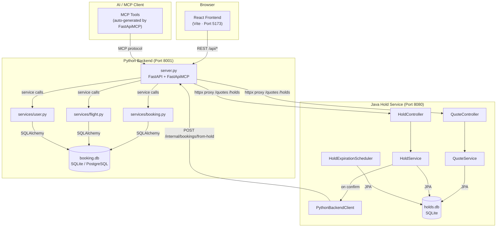
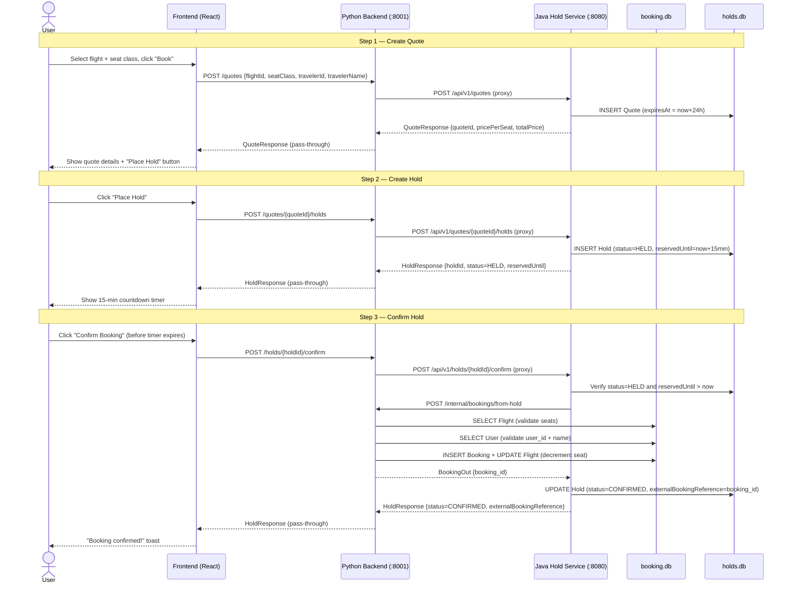

# Galaxium Travels — Contributor Onboarding Guide

> **Contributor level:** mid-level (solid full-stack professional experience)  
> **Generated by:** `onboarding-kit` skill — IBM Bob 2.0 Hackathon  
> **Detailed docs:** [`docs/onboarding/`](.)

---

## Table of Contents

1. [Project Overview](#1-project-overview)
2. [Architecture Summary](#2-architecture-summary)
3. [Services and Responsibilities](#3-services-and-responsibilities)
4. [Main Application Flows](#4-main-application-flows)
5. [Local Development Prerequisites](#5-local-development-prerequisites)
6. [Environment Variables](#6-environment-variables)
7. [Installation and Setup](#7-installation-and-setup)
8. [Build, Test, Lint, and Run](#8-build-test-lint-and-run)
9. [Known Setup Failures and Limitations](#9-known-setup-failures-and-limitations)
10. [Documentation Drift to Know About](#10-documentation-drift-to-know-about)
11. [Starter Tasks](#11-starter-tasks)
12. [Next Steps and Useful References](#12-next-steps-and-useful-references)

---

## 1. Project Overview

**Galaxium Travels** is a demo interplanetary flight-booking application.
Its primary purpose is to **showcase the challenges AI agents face when operating inside a real enterprise-style multi-service codebase** — three polyglot services, cross-service workflows, a dual REST + MCP backend, and intentional architectural constraints designed to be interesting and occasionally surprising to work with.

> Source: [`README.md`](../../README.md)

**What it does:**
- Lets users search, book, and cancel interplanetary flights across routes between Earth, Mars, the Moon, Venus, Jupiter, Europa, and Pluto.
- Offers three seat classes (Economy ×1.0, Business ×2.5, Galaxium ×5.0) with independent seat counters and live availability.
- Provides a **quote & hold workflow** — a user can reserve a seat with a time-limited hold (15 min) via a dedicated Java microservice before committing.
- Exposes every booking operation as both a **REST endpoint** and an **MCP tool**, so AI agents can interact natively.
- Ships with 10 demo travellers, 10 routes, and 20 pre-seeded bookings, ready to explore the moment you start.

**This is not a production system.** Data is ephemeral per container task in cloud deployments. The codebase contains deliberately non-standard patterns (e.g. service functions return `T | ErrorResponse` instead of raising exceptions) that are worth understanding before diving in.

---

## 2. Architecture Summary

The repository contains **three independently deployable services** plus an e2e test suite:

| Service | Stack | Native Port | Database |
|---|---|---|---|
| `booking_system_backend` | Python 3 / FastAPI + FastApiMCP | **8001** | SQLite (`booking.db`) or PostgreSQL |
| `booking_system_inventory_hold_service` | Java 17 / Spring Boot 3.4 | **8080** | SQLite (`holds.db`) |
| `booking_system_frontend` | React 19 / TypeScript / Vite 7 | **5173** | — |
| `e2e` | Python / pytest | — | ephemeral SQLite |

> Source: [`docs/onboarding/architecture.md`](architecture.md)

### Component Diagram



**Key architectural invariants (verified in source):**
- **The frontend never calls the Java service directly.** All `/api/*` calls route through the Python backend via the Vite dev proxy ([`vite.config.ts:9-13`](../../booking_system_frontend/vite.config.ts)).
- **Seat inventory is owned exclusively by the Python backend.** The Java service triggers a callback to Python on hold confirmation; Python is the sole authority that decrements seats.
- **`FastApiMCP(app)` at [`server.py:336`](../../booking_system_backend/server.py) auto-generates one MCP tool per REST route** — no separate MCP process.
- **`FastAPI` is instantiated at line 44; `FastApiMCP` wraps it at line 336** — FastAPI is created first (this is the correct order for lifespan composition).

---

## 3. Services and Responsibilities

### Python Backend (`booking_system_backend/`)

**Entry point:** [`server.py`](../../booking_system_backend/server.py) — run with `.venv/bin/python server.py` (listens on `:8001`).  
**Database:** SQLite (`./booking.db`) by default; PostgreSQL when `DATABASE_URL` is set (Docker Compose path).  
**Key dependencies:** FastAPI, FastApiMCP, SQLAlchemy, Pydantic, uvicorn, httpx.

This service is the hub of the system. It owns the `users`, `flights`, and `bookings` tables, exposes all booking REST endpoints, and auto-generates MCP tools from those routes via `FastApiMCP(app)`. It also acts as a **reverse proxy** to the Java hold service — all `/quotes/*` and `/holds/*` requests from the frontend pass through Python's proxy endpoints ([`server.py:242–330`](../../booking_system_backend/server.py)) before reaching Java.

Business logic lives in three service modules that return `T | ErrorResponse` (never raise): [`services/booking.py`](../../booking_system_backend/services/booking.py), [`services/flight.py`](../../booking_system_backend/services/flight.py), and [`services/user.py`](../../booking_system_backend/services/user.py). REST endpoints call `isinstance(result, ErrorResponse)` and manually map error codes to HTTP status codes.

**⚠️ Important:** `book_flight()` validates both `user_id` AND `name` — a name mismatch returns a 409 error. This is an intentional non-standard security pattern ([`booking.py:51-59`](../../booking_system_backend/services/booking.py)).

### Java Hold Service (`booking_system_inventory_hold_service/`)

**Entry point:** `mvn spring-boot:run` in the service directory (listens on `:8080`).  
**Database:** SQLite (`./holds.db`).  
**Key dependencies:** Spring Boot 3.4, Spring Data JPA, Lombok, Hibernate SQLite dialect.  
**Requires:** Java **17 or 21 only** — Lombok is incompatible with Java 22+.

This service manages the **quote → hold → confirm** lifecycle. A Quote (`Q-YYYY-######`) is a price estimate valid for 24 hours; a Hold (`H-YYYY-######`) is an inventory reservation valid for 15 minutes. On confirmation, the hold service calls the Python backend's `/internal/bookings/from-hold` endpoint to create the real booking.

The `HoldExpirationScheduler` runs every 60 seconds and sets expired holds to `EXPIRED` status. All state transitions are logged to an `audit_events` table.

**⚠️ Important:** Python proxy endpoints catch `httpx.HTTPError` and return `{"error": "..."}` with **HTTP 200** — not a 4xx/5xx. Callers must check the response body, not the status code ([`server.py:254`](../../booking_system_backend/server.py)).

### React Frontend (`booking_system_frontend/`)

**Entry point:** `npm run dev` (Vite dev server on `:5173`).  
**Key dependencies:** React 19, TypeScript 5.9, Vite 7, Tailwind CSS 3.4, Axios, React Router 7.

The frontend uses a custom space-themed Tailwind palette (`space-dark`, `space-blue`, `cosmic-purple`, `nebula-pink`, `alien-green`, `solar-orange`, `star-white`) — do not use standard Tailwind colour names not in this list.

The central booking experience lives in [`BookingModal.tsx`](../../booking_system_frontend/src/components/bookings/BookingModal.tsx) — a 3-step wizard: seat class selection → quote review → hold countdown with confirm/release actions. Pending holds are persisted to `localStorage` under the key `galaxium_holds_${userId}` via [`holdStorage.ts`](../../booking_system_frontend/src/utils/holdStorage.ts).

All API calls go through [`api.ts`](../../booking_system_frontend/src/services/api.ts). The axios response interceptor normalises all errors to `ErrorResponse` shape. **Always inspect `response.data.success` or check for `error` in the body — HTTP 200 is returned even for Java proxy errors.**

**There are no frontend unit tests.** ESLint is the only automated frontend check.

### E2E Suite (`e2e/`)

**Entry point:** `./e2e/run-native.sh` or `docker compose -f e2e/docker-compose.e2e.yml up`.  
**Key files:** [`test_smoke.py`](../../e2e/test_smoke.py) (5 tests), [`test_holds.py`](../../e2e/test_holds.py) (4 fast + 1 slow).

The e2e suite runs against an isolated stack using non-clashing ports (18001 for backend, 18082 for Java service) and short hold timers (1 minute instead of 15). The `E2E_RUN_SLOW=1` flag enables the ~90 s auto-expiry test. The Java hold service is **not behind a Docker Compose profile** in `e2e/docker-compose.e2e.yml` — it is always included.

---

## 4. Main Application Flows

### Flow 1: Direct Flight Booking

A user books a seat immediately without going through the hold system.

```
Frontend (Flights.tsx)
  → POST /api/book  { user_id, name, flight_id, seat_class }
    → Python server.py: book_flight_endpoint()
      → services/booking.py: book_flight()
        1. Validate seat_class literal
        2. Look up Flight by flight_id → NOT FOUND → ErrorResponse (404)
        3. Check seats_available for seat class → 0 → ErrorResponse (409)
        4. Query User by user_id AND name → mismatch → ErrorResponse (409)
        5. Calculate price = base_price × multiplier
        6. Decrement seat counter for seat class
        7. INSERT Booking (status=booked)
        8. COMMIT → return BookingOut
    ← HTTP 200 BookingOut  (or 404/409 on error)
  ← Booking confirmation shown in UI
```
*Only `booking.db` is touched. Java service not involved.*

---

### Flow 2: Quote → Hold → Confirm (Cross-Service)

This is the most important and architecturally complex flow.



*Both `holds.db` and `booking.db` are touched. Seat count change originates in Python even though the confirmation was initiated via Java.*

---

## 5. Local Development Prerequisites

> Source: [`docs/onboarding/verified-setup.md`](verified-setup.md) — Section 1

| Runtime | Required Version | Notes |
|---|---|---|
| Python | **3.8+** | On Windows, use `py` launcher; `python`/`python3` may resolve to Microsoft Store stubs |
| Node.js | **18+** | Verified at 24.12.0 |
| npm | bundled with Node | Verified at 11.6.2 |
| Java | **17 or 21 only** | **Java 22+ is incompatible** — Lombok annotation processing breaks. Install Adoptium Temurin 17 or 21 and set `JAVA_HOME` explicitly. |
| Maven | **3.6+** | Must be on PATH for Java service build/run |
| Docker + Docker Compose | latest stable | Required for `docker compose up` and e2e Docker path only; not required for native dev |

**⚠️ Critical Java constraint:** Lombok 1.18.36 (used throughout the Java hold service) does **not** support Java 22+. If your system Java is 22+, you must install 17 or 21 and point `JAVA_HOME` at it manually.

**macOS / Colima:** See the macOS notes in [`verified-setup.md`](verified-setup.md) for the `docker-buildx` plugin setup required to avoid Keychain prompts and amd64 emulation.

---

## 6. Environment Variables

> Source: [`docs/onboarding/verified-setup.md`](verified-setup.md) — Section 3

### Python Backend (`booking_system_backend/`)

| Variable | Default | Description |
|---|---|---|
| `DATABASE_URL` | `sqlite:///./booking.db` | SQLAlchemy connection URL. Unset = SQLite. |
| `SEED_DEMO_DATA` | `true` | Seeds demo data on startup **if the DB is empty** (guarded by `User.count() == 0`). |
| `JAVA_SERVICE_URL` | `http://localhost:8080` | URL of the Java hold service (used by proxy endpoints). |
| `CORS_ORIGINS` | `http://localhost:5173,http://localhost` | Comma-separated allowed CORS origins. |

### Java Hold Service (`booking_system_inventory_hold_service/`)

| Variable | Default | Description |
|---|---|---|
| `PYTHON_BACKEND_URL` | `http://localhost:8001` | Python backend URL for hold-confirm callbacks. |
| `SPRING_DATASOURCE_URL` | `jdbc:sqlite:./holds.db` | Hold service database. |
| `HOLD_DURATION_MINUTES` | `15` | How long a hold remains active. |
| `HOLD_EXPIRATION_CHECK_INTERVAL_SECONDS` | `60` | Scheduler polling interval. |

### Frontend (`booking_system_frontend/`)

| Variable | Default | Description |
|---|---|---|
| `VITE_API_URL` | `http://localhost:8001` | Backend URL used in production builds. Copy `.env.example` to `.env` to override. |

---

## 7. Installation and Setup

> Source: [`docs/onboarding/verified-setup.md`](verified-setup.md) — Section 4

### Python Backend

**Working directory:** `booking_system_backend/`

```powershell
# Windows (use py launcher)
py -m venv .venv
.venv\Scripts\python.exe -m pip install -r requirements.txt

# macOS / Linux
python3 -m venv .venv
.venv/bin/pip install -r requirements.txt
```

**Status: ✅ Verified** — all packages installed successfully.

> **⚠️ Known issue:** `ruff` and `mypy` are **not** in `requirements.txt`. They are documented as development tools in `AGENTS.md` but must be installed separately:
> ```
> .venv\Scripts\python.exe -m pip install ruff mypy   # Windows
> .venv/bin/pip install ruff mypy                       # macOS/Linux
> ```

### Frontend

**Working directory:** `booking_system_frontend/`

```bash
npm install
```

**Status: ✅ Verified** — installed with 20 pre-existing audit warnings (non-blocking).

### Java Hold Service

**Working directory:** `booking_system_inventory_hold_service/`

```bash
mvn clean package -DskipTests
```

**Status: ❌ Untested on this machine** — requires Maven on PATH and Java 17 or 21. The session host had Java 25.0.1 (incompatible) and Maven was not installed.

---

## 8. Build, Test, Lint, and Run

> Source: [`docs/onboarding/verified-setup.md`](verified-setup.md) — Sections 5–7

### Python Backend

| Command | Working Dir | Status | Notes |
|---|---|---|---|
| *(no build — interpreted)* | — | ✅ N/A | venv install is the only step |
| `.venv/Scripts/python.exe -m pytest tests/test_services.py -v` | `booking_system_backend/` | ✅ **37/37 PASSED** | Service-layer tests; no external deps |
| `.venv/Scripts/python.exe -m pytest -v --tb=short` | `booking_system_backend/` | ❌ **35 errors** | `fastapi-mcp`/`mcp` version incompatibility — see Section 9 |
| `.venv/Scripts/ruff.exe check .` | `booking_system_backend/` | ❌ untested | `ruff` not in `requirements.txt`; install separately |
| `.venv/Scripts/mypy.exe . --ignore-missing-imports` | `booking_system_backend/` | ❌ untested | `mypy` not in `requirements.txt`; baseline at `.bob/hooks/mypy-baseline.txt` |
| `.venv/Scripts/python.exe server.py` | `booking_system_backend/` | ❌ untested | Import fails due to `fastapi-mcp`/`mcp` incompatibility until fixed |

### Frontend

| Command | Working Dir | Status | Notes |
|---|---|---|---|
| `npm run build` | `booking_system_frontend/` | ✅ **Verified** | `tsc -b` then Vite; 2488 modules in 12.45 s |
| `npm run lint` | `booking_system_frontend/` | ✅ **No issues** | Zero ESLint errors |
| `npm run dev` | `booking_system_frontend/` | ❌ untested | Not started (port binding); build is verified |

### Java Hold Service

| Command | Working Dir | Status | Notes |
|---|---|---|---|
| `mvn clean package` | `booking_system_inventory_hold_service/` | ❌ untested | Maven not on PATH; Java 25.0.1 incompatible |
| `mvn test -q` | `booking_system_inventory_hold_service/` | ❌ untested | Same blockers; ~118 tests expected |
| `mvn spring-boot:run` | `booking_system_inventory_hold_service/` | ❌ untested | Same blockers |

### Full Stack

| Command | Working Dir | Status | Notes |
|---|---|---|---|
| `./start.sh` | repo root | ❌ untested | Bash script; requires Java 17/21 + Maven |
| `docker compose up` | repo root | ❌ untested | Docker not installed on session host |
| `docker compose --profile hold-service up` | repo root | ❌ untested | Java service behind `hold-service` profile |
| `./e2e/run-native.sh` | repo root | ❌ untested | Requires Java 17/21, Maven, bash |

---

## 9. Known Setup Failures and Limitations

> Source: [`docs/onboarding/verified-setup.md`](verified-setup.md) — Sections 9 and 10

### 🔴 Critical — `fastapi-mcp` / `mcp` version incompatibility

**Impact:** 35/72 backend tests fail; Python backend server cannot start.

**Symptom:**
```
TypeError: Server.__init__() takes 2 positional arguments but 3 were given
```
at `server.py:336` when `FastApiMCP(app)` is called at import time.

**Root cause:** `requirements.txt` has no version pins for `fastapi-mcp` or `mcp`. The latest resolver installs `fastapi-mcp==0.4.0` + `mcp==2.2.0`. The `mcp 2.2.0` library changed the `Server` constructor signature, breaking `fastapi-mcp 0.4.0`.

**Fix:** Pin compatible versions in `requirements.txt`. Either downgrade `mcp` to the version `fastapi-mcp 0.4.0` was tested against, or upgrade `fastapi-mcp` to a version that supports `mcp 2.x`. This is **Starter Task 1** below.

---

### 🟡 Medium — `ruff` and `mypy` not in `requirements.txt`

**Impact:** Lint and type-check steps fail after a fresh install.

**Fix:** Add `ruff` and `mypy` to `requirements.txt` (or a new `requirements-dev.txt`). This is **Starter Task 2** below.

---

### 🟡 Medium — Java 22+ incompatible with Lombok

**Impact:** Java hold service cannot be built or tested on machines with Java 22+.

**Fix:** Install Java 17 or 21 (Adoptium Temurin recommended) and set `JAVA_HOME` explicitly.

---

### 🟡 Medium — Maven not installed / not on PATH

**Impact:** All Java service commands (build, test, run) are blocked.

**Fix:** Install Maven 3.6+ and add its `bin/` to PATH.

---

### ℹ️ Informational — Windows Python launcher

On Windows, `python` and `python3` may resolve to Microsoft Store stubs. Use `py` (Python Launcher for Windows) instead:
```powershell
py -m venv .venv
.venv\Scripts\python.exe -m pip install -r requirements.txt
```

---

### ℹ️ Informational — Docker not required for native development

Docker is only required for `docker compose up` and the Docker-based e2e path. Native local development (Python + Java + npm) works without Docker.

---

## 10. Documentation Drift to Know About

> Source: [`docs/onboarding/docs-drift-report.md`](docs-drift-report.md) — Section 4

These are claims in existing documentation that do **not** match the current codebase. Be aware of them before relying on the docs for debugging.

### High-Impact Drifts

| ID | Doc | Incorrect Claim | Actual (verified) | Evidence |
|---|---|---|---|---|
| D-1 | `AGENTS.md` | "server.py **line 22** instantiates `FastMCP` **before** `FastAPI`" | `FastAPI` is created at **line 44**; `FastApiMCP(app)` wraps it at **line 336** — FastAPI is first | [`server.py:44`](../../booking_system_backend/server.py) |
| D-2 | `booking_system_inventory_hold_service/README.md` | "`PYTHON_BACKEND_URL` default: `http://localhost:8000`" | Actual default is `http://localhost:**8001**` | [`application.properties:16`](../../booking_system_inventory_hold_service/src/main/resources/application.properties) |
| D-3 | `AGENTS.md` | "conftest.py lines 49–50 patches both `db.SessionLocal` and `server.SessionLocal`" | Actual mechanism is `app.dependency_overrides[get_db]` — FastAPI's DI override, not direct attribute patching | [`conftest.py:49-55`](../../booking_system_backend/tests/conftest.py) |

### Medium-Impact Drifts

| ID | Doc | Incorrect Claim | Actual (verified) | Evidence |
|---|---|---|---|---|
| D-4 | `AGENTS.md` | "`SEED_DEMO_DATA=true` re-seeds on **every** start" | `seed()` guards with `if db.query(User).count() == 0`; **never overwrites** existing data | [`seed.py:17-20`](../../booking_system_backend/seed.py) |
| D-6 | `booking_system_backend/README.md` | "One codebase, one port (**8080**), both protocols" | Native `python server.py` binds **8001**; Docker container uses 8080 — two different ports | [`server.py:344`](../../booking_system_backend/server.py) |
| D-7 | `booking_system_inventory_hold_service/README.md` | "Spring Boot **3.2.0**" | Actual version is **3.4.1** | [`pom.xml:19`](../../booking_system_inventory_hold_service/pom.xml) |

### Low-Impact Drifts

| ID | Doc | Incorrect Claim | Actual | Evidence |
|---|---|---|---|---|
| D-8 | `README.md` / `AGENTS.md` | "`holds.db` and `booking.db` are committed artefacts" | Neither `.db` file was present in the repo at audit time | — |
| D-9 | `docs/onboarding/architecture.md` | "localStorage key `holds_{userId}`" | Actual key prefix is `galaxium_holds_` | [`holdStorage.ts:3`](../../booking_system_frontend/src/utils/holdStorage.ts) |

---

## 11. Starter Tasks

> Source: [`docs/onboarding/starter-tasks.md`](starter-tasks.md)  
> Tailored for: **mid-level contributor** (architectural context and testing requirements included)

### Task 1 — Pin `fastapi-mcp` and `mcp` versions in `requirements.txt` ⭐ Highest Priority

**Rank:** 1 of 5  
**Source:** `verified-setup.md` Error 1 (Critical)  
**Files:** [`booking_system_backend/requirements.txt`](../../booking_system_backend/requirements.txt)

**What to do:** Add explicit version pins for `fastapi-mcp` and `mcp` so that `pip install -r requirements.txt` resolves to a compatible pair. This directly unblocks the 35 currently failing REST tests.

**Architectural context:** `FastApiMCP(app)` at [`server.py:336`](../../booking_system_backend/server.py) wraps the FastAPI app to auto-generate MCP tools. The `mcp` package's `Server.__init__()` signature changed in 2.2.0, breaking `fastapi-mcp 0.4.0`'s setup call. Until this is fixed, the Python backend cannot start and 35/72 tests error at collection.

**Testing requirement:** After applying the fix, the full pytest suite must pass:
```powershell
cd booking_system_backend
.venv\Scripts\python.exe -m pytest -v --tb=short
# Expect: 72 tests passing, 0 errors
```

**How to find the right pin:** Install `fastapi-mcp==0.4.0` in isolation and inspect its declared `mcp` dependency range in its `pyproject.toml`. Alternatively, check whether a newer `fastapi-mcp` already supports `mcp 2.x`.

**Risk:** Low — adding a version pin cannot break the 37 already-passing service tests.

---

### Task 2 — Add `ruff` and `mypy` to `requirements.txt`

**Rank:** 2 of 5  
**Source:** `verified-setup.md` Error 2  
**Files:** [`booking_system_backend/requirements.txt`](../../booking_system_backend/requirements.txt)

**What to do:** Add `ruff` and `mypy` to the install manifest so a fresh `pip install -r requirements.txt` makes both tools available without extra steps.

**Architectural context:** `AGENTS.md` documents `ruff check .` as the lint command and `mypy . --ignore-missing-imports` as the type-check command, but neither tool is installed by the standard setup. Decide: add to `requirements.txt` (simplicity) or create a separate `requirements-dev.txt` (cleaner separation of runtime vs. dev deps). Either is defensible; document the choice.

**Testing requirement:**
```bash
# After fix, from scratch:
pip install -r requirements.txt
ruff check .       # should complete with no errors
mypy . --ignore-missing-imports   # pre-existing errors are in .bob/hooks/mypy-baseline.txt
```

**Note on mypy baseline:** `.bob/hooks/mypy-baseline.txt` records pre-existing type errors. Only errors *not* in the baseline are actionable.

**Risk:** Zero — dev tooling only; no runtime or test behaviour changes.

---

### Task 3 — Fix three incorrect footgun claims in `AGENTS.md`

**Rank:** 3 of 5  
**Source:** Drift findings D-1, D-3, D-4  
**Files:** [`AGENTS.md`](../../AGENTS.md)

**What to do:** Correct three factually wrong claims in the AGENTS.md footguns section:

| Finding | Current incorrect text | Correction needed |
|---|---|---|
| D-1 | "server.py line 22 instantiates `FastMCP` before `FastAPI`" | FastAPI is at line 44; `FastApiMCP` at line 336 — FastAPI is first. The underlying intent (initialisation order matters for lifespan composition) is valid but the direction and line are wrong. |
| D-3 | "conftest.py lines 49–50 patches both `db.SessionLocal` and `server.SessionLocal`" | The actual mechanism is `server.app.dependency_overrides[get_db]` — FastAPI's dependency injection override. |
| D-4 | "`SEED_DEMO_DATA=true` re-seeds on every start — set to `false` if you need data to survive" | `seed()` checks `User.count() == 0` before seeding; data is never overwritten regardless of the flag. |

**Read before editing:**
- [`server.py:40-50`](../../booking_system_backend/server.py) and [`server.py:333-340`](../../booking_system_backend/server.py) — verify FastAPI/FastApiMCP order
- [`tests/conftest.py:39-60`](../../booking_system_backend/tests/conftest.py) — understand `dependency_overrides` vs. monkeypatch
- [`seed.py:13-25`](../../booking_system_backend/seed.py) — verify the `count() == 0` guard

**Risk:** None — documentation only. Submit all three corrections in a single PR.

---

### Task 4 — Fix port and version errors in `booking_system_inventory_hold_service/README.md`

**Rank:** 4 of 5  
**Source:** Drift findings D-2, D-7  
**Files:** [`booking_system_inventory_hold_service/README.md`](../../booking_system_inventory_hold_service/README.md)

**What to do:** Fix four stale values in the hold-service README:

| Location | Incorrect | Correct | Evidence |
|---|---|---|---|
| Prerequisites section | Python backend on port **8000** | Port **8001** | [`application.properties:16`](../../booking_system_inventory_hold_service/src/main/resources/application.properties) |
| Configuration section (sample block) | `python.backend.url=http://localhost:8000` | `http://localhost:8001` | Same |
| Environment variable table | `PYTHON_BACKEND_URL` default `http://localhost:8000` | `http://localhost:8001` | Same |
| Version reference | "Spring Boot **3.2.0**" | **3.4.1** | [`pom.xml:19`](../../booking_system_inventory_hold_service/pom.xml) |

**Architectural context:** The wrong port (8000 vs 8001) is a developer trap — someone following the README to bring up the Java service standalone will point it at the wrong Python backend and see HTTP connection failures with no clear cause.

**Also check:** The Docker run example (`-e PYTHON_BACKEND_URL=http://host.docker.internal:8000`) may also need updating — verify whether this is intentional (Docker network context) or a copy-paste error.

**Risk:** None — documentation only.

---

### Task 5 — Correct the `holdStorage.ts` localStorage key in `architecture.md`

**Rank:** 5 of 5  
**Source:** Drift finding D-9  
**Files:** [`docs/onboarding/architecture.md`](architecture.md)

**What to do:** Update the one sentence that describes the localStorage key. Current text says `holds_{userId}`; the actual key prefix is `galaxium_holds_` ([`holdStorage.ts:3`](../../booking_system_frontend/src/utils/holdStorage.ts)).

**Architectural context:** This matters for browser DevTools debugging — searching localStorage for `holds_` will find nothing; `galaxium_holds_` is the correct key. As a mid-level contributor, add extra value by also checking [`MyBookings.tsx`](../../booking_system_frontend/src/pages/MyBookings.tsx) and [`BookingModal.tsx`](../../booking_system_frontend/src/components/bookings/BookingModal.tsx) to verify the key is used consistently.

**Note:** `architecture.md` is a generated file — check whether regeneration would overwrite the fix.

**Risk:** None — documentation only.

---

### Starter Task Summary

| Rank | Task | Change | Unblocks |
|---|---|---|---|
| 1 ⭐ | Pin `fastapi-mcp`+`mcp` in `requirements.txt` | `requirements.txt` | 35 failing backend tests + server startup |
| 2 | Add `ruff` + `mypy` to `requirements.txt` | `requirements.txt` | Lint and type-check workflows |
| 3 | Fix 3 incorrect footguns in `AGENTS.md` | `AGENTS.md` | Developer/agent debugging accuracy |
| 4 | Fix port + version in hold-service `README.md` | `booking_system_inventory_hold_service/README.md` | Standalone Java service bring-up |
| 5 | Fix localStorage key in `architecture.md` | `docs/onboarding/architecture.md` | Browser DevTools debugging accuracy |

---

## 12. Next Steps and Useful References

### Generated Onboarding Docs

| Document | Contents |
|---|---|
| [`docs/onboarding/architecture.md`](architecture.md) | Full architecture reference with Mermaid component, sequence, and use-case diagrams |
| [`docs/onboarding/docs-drift-report.md`](docs-drift-report.md) | 87 verified claims; 11 drifted, 5 unverified |
| [`docs/onboarding/verified-setup.md`](verified-setup.md) | Step-by-step setup verification with exact errors and fixes |
| [`docs/onboarding/starter-tasks.md`](starter-tasks.md) | Full 5-task writeup with evidence, file refs, and risk assessment |

### Key Source Files

| File | Why read it |
|---|---|
| [`booking_system_backend/server.py`](../../booking_system_backend/server.py) | All REST endpoints + MCP setup + Java proxy — the hub of the system |
| [`booking_system_backend/services/booking.py`](../../booking_system_backend/services/booking.py) | Booking business logic; illustrates the `T \| ErrorResponse` return pattern |
| [`booking_system_backend/tests/conftest.py`](../../booking_system_backend/tests/conftest.py) | How tests override the DB dependency via `dependency_overrides` |
| [`booking_system_inventory_hold_service/src/main/java/com/galaxium/holdservice/service/HoldService.java`](../../booking_system_inventory_hold_service/src/main/java/com/galaxium/holdservice/service/HoldService.java) | Hold confirm logic + callback to Python |
| [`booking_system_frontend/src/services/api.ts`](../../booking_system_frontend/src/services/api.ts) | All API calls; error normalisation; proxy-error detection pattern |
| [`e2e/test_holds.py`](../../e2e/test_holds.py) | Black-box cross-service hold flow tests — excellent architecture reference |
| [`AGENTS.md`](../../AGENTS.md) | Developer + agent guidance; footguns section (read with D-1/D-3/D-4 drift fixes in mind) |

### Important READMEs

| File | Contents |
|---|---|
| [`README.md`](../../README.md) | Project overview, quick-start options, service endpoints table, MCP tools table |
| [`booking_system_backend/README.md`](../../booking_system_backend/README.md) | Backend API reference |
| [`booking_system_inventory_hold_service/README.md`](../../booking_system_inventory_hold_service/README.md) | Java service API and config (**note: contains drifted port — see Section 10**) |
| [`e2e/README.md`](../../e2e/README.md) | E2E test runner options and environment variables |

### Useful Commands at a Glance

```bash
# Python backend — service tests only (fast, no external deps)
cd booking_system_backend
.venv/Scripts/python.exe -m pytest tests/test_services.py -v   # Windows
.venv/bin/python -m pytest tests/test_services.py -v            # macOS/Linux

# Frontend — build + lint
cd booking_system_frontend
npm run build && npm run lint

# Full stack (requires Java 17/21 + Maven + bash)
./start.sh

# Docker Compose (+ Java hold service)
docker compose --profile hold-service up

# E2E tests (native)
./e2e/run-native.sh
```
