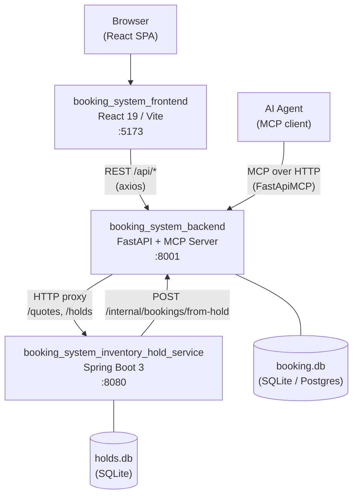
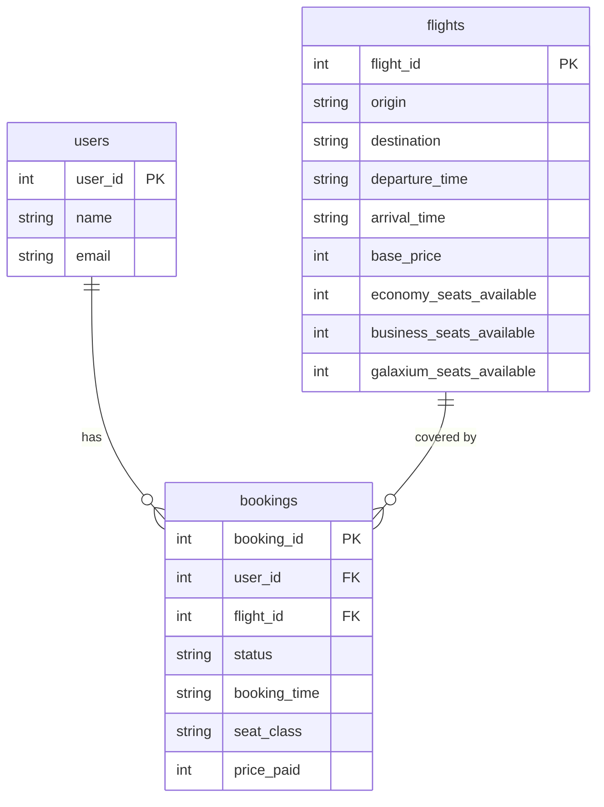
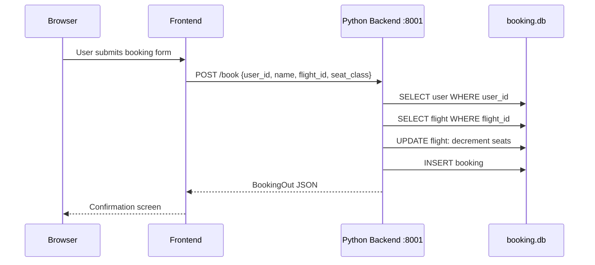
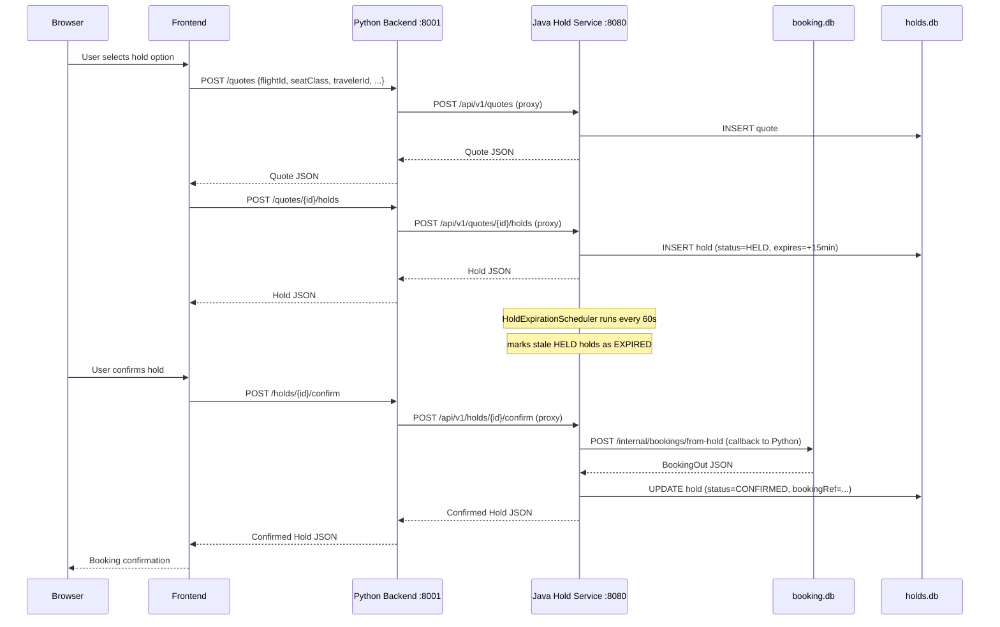

# Galaxium Travels — Architecture Map

> All claims in this document are traced to a specific file and line.
> Items that could not be confirmed from the repository are labelled **[UNVERIFIED]**.

---

## 1. System Overview

Galaxium Travels is a demo interplanetary flight-booking application with three runtime services and a dedicated end-to-end test suite.
([`AGENTS.md` line 7](../../AGENTS.md))

| Service | Technology | Port (local native) | Port (Docker Compose) | Database |
|---|---|---|---|---|
| **Python Backend** | FastAPI + SQLAlchemy + SQLite/Postgres | `8001` | `8001` → container `8080` | `booking.db` (SQLite default) |
| **Java Hold Service** | Spring Boot 3 + JPA + SQLite | `8080` | `8082` → container `8080` | `holds.db` (SQLite default) |
| **React Frontend** | React 19 + Vite + TypeScript + Tailwind | `5173` | `5173` → container `8080` | — |

Sources: [`server.py` line 344](../../booking_system_backend/server.py:344), [`application.properties` line 3](../../booking_system_inventory_hold_service/src/main/resources/application.properties:3), [`docker-compose.yml` lines 21–22, 43–44, 64–65](../../docker-compose.yml).

---

## 2. Component Diagram

Sources: [`server.py` lines 242–331](../../booking_system_backend/server.py:242), [`server.py` lines 221–237](../../booking_system_backend/server.py:221), [`server.py` lines 336–337](../../booking_system_backend/server.py:336), [`api.ts` lines 14–19](../../booking_system_frontend/src/services/api.ts:14).

---

## 3. Services and Responsibilities

### 3.1 Python Backend (`booking_system_backend/`)

Entry point: [`server.py`](../../booking_system_backend/server.py) — runs with `uvicorn` on port `8001` ([`server.py` line 344](../../booking_system_backend/server.py:344)).

Responsibilities:
- **REST API**: Flights (`GET /flights`), bookings (`POST /book`, `GET /bookings/{user_id}`, `POST /cancel/{booking_id}`), users (`POST /register`, `GET /user`). ([`server.py` lines 70–213](../../booking_system_backend/server.py:70))
- **Internal endpoint**: `POST /internal/bookings/from-hold` is called by the Java service when confirming a hold. ([`server.py` lines 221–237](../../booking_system_backend/server.py:221))
- **Java proxy**: `POST /quotes`, `GET /quotes/{id}`, `POST /quotes/{id}/holds`, `GET /holds/{id}`, `POST /holds/{id}/confirm`, `POST /holds/{id}/release` — each proxies to `JAVA_SERVICE_URL` via `httpx`. ([`server.py` lines 242–331](../../booking_system_backend/server.py:242))
- **MCP server**: `FastApiMCP(app)` auto-generates MCP tools from every FastAPI route. Mounted via `mcp.mount_http()`. ([`server.py` lines 336–337](../../booking_system_backend/server.py:336))
- **Database**: SQLAlchemy `SessionLocal` backed by `DATABASE_URL` env var; defaults to `sqlite:///./booking.db`. ([`db.py` lines 9–12](../../booking_system_backend/db.py:9))
- **Business logic**: `services/booking.py`, `services/flight.py`, `services/user.py` — functions return `T | ErrorResponse`, never raise. ([`AGENTS.md` line 21](../../AGENTS.md))

### 3.2 Java Hold Service (`booking_system_inventory_hold_service/`)

Entry point: `HoldServiceApplication.java`, runs on port `8080` ([`application.properties` line 3](../../booking_system_inventory_hold_service/src/main/resources/application.properties:3)).

Responsibilities:
- **Quote lifecycle**: `POST /api/v1/quotes` creates a time-limited price quote. `GET /api/v1/quotes/{id}` retrieves it.
- **Hold lifecycle**: `POST /api/v1/quotes/{id}/holds` reserves a seat for 15 minutes. `POST /api/v1/holds/{id}/confirm` finalises the booking by calling back to Python. `POST /api/v1/holds/{id}/release` frees the hold manually.
- **Auto-expiry**: `HoldExpirationScheduler` fires every 60 s and marks stale HELD records as EXPIRED. ([`HoldExpirationScheduler.java` lines 24–51](../../booking_system_inventory_hold_service/src/main/java/com/galaxium/holdservice/scheduler/HoldExpirationScheduler.java:24))
- **Python callback**: `PythonBackendClient.createBookingFromHold()` calls `POST {PYTHON_BACKEND_URL}/internal/bookings/from-hold`. ([`PythonBackendClient.java` line 32](../../booking_system_inventory_hold_service/src/main/java/com/galaxium/holdservice/client/PythonBackendClient.java:32))
- **Database**: SQLite `holds.db`; schema managed by Hibernate `ddl-auto=update`. ([`application.properties` lines 6–11](../../booking_system_inventory_hold_service/src/main/resources/application.properties:6))

Hold status state machine: `HELD → CONFIRMED | EXPIRED | RELEASED | CONFIRMATION_FAILED` ([`HoldService.java` lines 82–134](../../booking_system_inventory_hold_service/src/main/java/com/galaxium/holdservice/service/HoldService.java:82))

### 3.3 React Frontend (`booking_system_frontend/`)

Entry: Vite dev server on port `5173`. Base URL for all API calls: `VITE_API_URL` env var, falling back to `/api`. ([`api.ts` lines 14–19](../../booking_system_frontend/src/services/api.ts:14))

All API calls go through the axios instance in [`api.ts`](../../booking_system_frontend/src/services/api.ts). The Python proxy returns HTTP 200 even on Java errors; the frontend calls `assertNotProxyError()` to detect the embedded `{"error":"..."}` body. ([`api.ts` lines 161–165](../../booking_system_frontend/src/services/api.ts:161))

---

## 4. Data Model (Python Backend — `booking.db`)

Source: [`models.py` lines 14–40](../../booking_system_backend/models.py:14).

`booking.status` values: `booked`, `cancelled`, `completed`. ([`models.py` lines 8–12](../../booking_system_backend/models.py:8))

---

## 5. Key Application Flows

### 5.1 Direct Booking Flow

Key validation: `book_flight()` checks both `user_id` AND `name` — intentional security pattern. ([`AGENTS.md` line 22](../../AGENTS.md)) Source: [`server.py` lines 152–166](../../booking_system_backend/server.py:152).

### 5.2 Hold-and-Confirm Flow

Sources: [`server.py` lines 242–315](../../booking_system_backend/server.py:242), [`HoldService.java` lines 102–111](../../booking_system_inventory_hold_service/src/main/java/com/galaxium/holdservice/service/HoldService.java:102), [`PythonBackendClient.java` line 32](../../booking_system_inventory_hold_service/src/main/java/com/galaxium/holdservice/client/PythonBackendClient.java:32).

---

## 6. Environment Variables

| Variable | Default | Service | Source |
|---|---|---|---|
| `DATABASE_URL` | `sqlite:///./booking.db` | Python Backend | [`db.py` line 9](../../booking_system_backend/db.py:9) |
| `SEED_DEMO_DATA` | `true` | Python Backend | [`server.py` line 34](../../booking_system_backend/server.py:34) |
| `CORS_ORIGINS` | `*` | Python Backend | [`server.py` line 53](../../booking_system_backend/server.py:53) |
| `JAVA_SERVICE_URL` | `http://localhost:8080` | Python Backend | [`server.py` line 218](../../booking_system_backend/server.py:218) |
| `PYTHON_BACKEND_URL` | `http://localhost:8001` | Java Hold Service | [`application.properties` line 16](../../booking_system_inventory_hold_service/src/main/resources/application.properties:16) |
| `SPRING_DATASOURCE_URL` | `jdbc:sqlite:./holds.db` | Java Hold Service | [`application.properties` line 6](../../booking_system_inventory_hold_service/src/main/resources/application.properties:6) |
| `VITE_API_URL` | `/api` | Frontend | [`api.ts` line 15](../../booking_system_frontend/src/services/api.ts:15) |

In Docker Compose: `DATABASE_URL` is set to Postgres, `JAVA_SERVICE_URL` points to `http://java-service:8080`, `PYTHON_BACKEND_URL` in Java points to `http://backend:8080`. ([`docker-compose.yml` lines 23–27, 45–46](../../docker-compose.yml))

---

## 7. Ports Summary

| Service | Native port | Docker Compose host port | Docker internal port |
|---|---|---|---|
| Python Backend | `8001` | `8001` | `8080` |
| Java Hold Service | `8080` | `8082` | `8080` |
| React Frontend | `5173` | `5173` | `8080` |
| Postgres (Docker only) | — | `5433` | `5432` |

Sources: [`docker-compose.yml` lines 21–22, 43–44, 64–65, 8–9](../../docker-compose.yml).

---

## 8. Runtime Boundaries and Coupling Points

- **MCP tools bypass FastAPI DI**: MCP tool handlers call `SessionLocal()` and `db.close()` directly — do NOT use `Depends(get_db)`. ([`AGENTS.md` line 20](../../AGENTS.md))
- **MCP is auto-generated**: `FastApiMCP(app)` generates one MCP tool per FastAPI route; no manual tool registration needed for existing routes. ([`server.py` lines 336–337](../../booking_system_backend/server.py:336))
- **Proxy swallows Java errors**: All Java proxy endpoints catch `httpx.HTTPError` and return `{"error": "..."}` with HTTP 200. Callers must inspect the body. ([`server.py` lines 254–255](../../booking_system_backend/server.py:254))
- **Docker Java service behind profile**: `docker-compose.yml` requires `--profile hold-service` to start the Java service. `e2e/docker-compose.e2e.yml` enables it unconditionally. ([`AGENTS.md` line 27](../../AGENTS.md))
- **SQLite is the default database**: Both services default to SQLite. The committed `.db` files seed local dev. ([`AGENTS.md` line 23](../../AGENTS.md))

---

## 9. Test Structure

| Suite | Location | DB strategy |
|---|---|---|
| Python unit/integration | `booking_system_backend/tests/` | In-memory SQLite, `StaticPool`; patches `db.SessionLocal` AND `server.SessionLocal` ([`conftest.py` lines 49–50](../../booking_system_backend/tests/conftest.py:49)) |
| Java unit tests | `booking_system_inventory_hold_service/src/test/` | [UNVERIFIED — not traced] |
| E2E (pytest + Docker Compose) | `e2e/` | `e2e/docker-compose.e2e.yml` (non-clashing ports) |

---

## 10. Deployment

- **AWS**: ECS + ALB; Terraform under `scripts/terraform/`. ([`AGENTS.md` line 136](../../AGENTS.md))
- **IBM Cloud**: IBM Code Engine; deploy script at `scripts/ibm/deploy-to-ibm.sh`. ([`AGENTS.md` line 97](../../AGENTS.md))
- On ECS, `DATABASE_URL` is intentionally unset; backend falls back to SQLite (ephemeral per task). ([`AGENTS.md` line 23](../../AGENTS.md))
