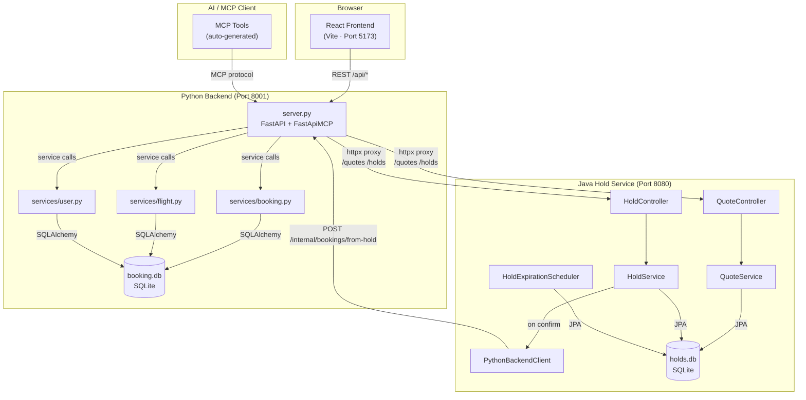
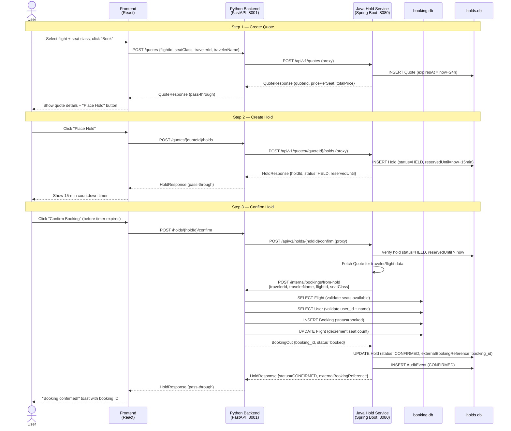
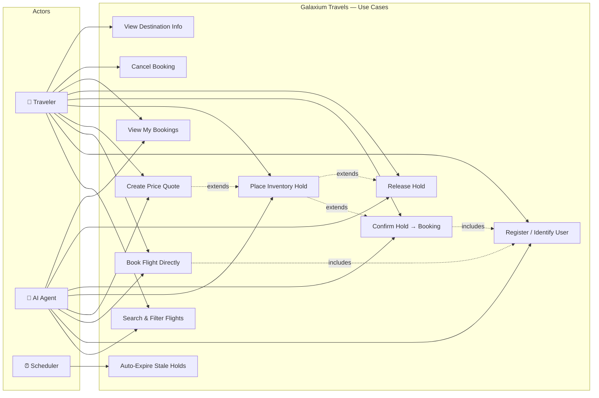

# Galaxium Travels — Architecture Overview

> **Generated by:** Ramp Architecture Mapper (IBM Bob 2.0 Hackathon)
> **Source:** All claims in this document are grounded in repository files read during analysis.
> **Do not edit manually** — regenerate by running the `ramp-architecture-mapper` mode.

---

## Table of Contents

1. [Repository Overview](#1-repository-overview)
2. [Major Modules](#2-major-modules)
3. [Application Entry Points](#3-application-entry-points)
4. [End-to-End Data Flows](#4-end-to-end-data-flows)
5. [Module Relationships](#5-module-relationships)
6. [Architecture Diagram (Mermaid)](#6-architecture-diagram)
7. [Sequence Diagram — Hold-to-Booking Flow](#7-sequence-diagram--hold-to-booking-flow)
8. [Use-Case Diagram](#8-use-case-diagram)

---

## 1. Repository Overview

Galaxium Travels is a demo **interplanetary flight-booking application** built to showcase the challenges AI agents face in a real multi-service codebase. It is not a production system; its purpose is as a showcase/demo platform.

The repository contains four independently deployable services plus an e2e test suite:

| Service | Language / Framework | Port | Purpose |
|---|---|---|---|
| `booking_system_backend` | Python 3 / FastAPI + FastApiMCP | 8001 | Core booking API, MCP tool server, Java proxy |
| `booking_system_inventory_hold_service` | Java 17 / Spring Boot 3 | 8080 | Quote and inventory-hold lifecycle |
| `booking_system_frontend` | React 19 / TypeScript / Vite | 5173 | Browser UI |
| `e2e` | Python / pytest | — | Cross-service end-to-end tests |

**Databases (both committed as artefacts):**
- `booking.db` — SQLite, owned by Python backend. Contains users, flights, bookings.
- `holds.db` — SQLite, owned by Java service. Contains quotes, holds, audit events.

---

## 2. Major Modules

### 2.1 Python Backend (`booking_system_backend/`)

| File / Directory | Role |
|---|---|
| `server.py` | FastAPI app + MCP server. Defines all REST endpoints and auto-generates MCP tools. Acts as reverse proxy to the Java service for quote/hold routes. Entry point: `uvicorn server:app` on port 8001. |
| `db.py` | SQLAlchemy engine, `SessionLocal` factory, `get_db()` FastAPI dependency. Reads `DATABASE_URL` env (defaults to `sqlite:///./booking.db`). |
| `models.py` | ORM models: `User`, `Flight`, `Booking`, `BookingStatus` enum. |
| `schemas.py` | Pydantic request/response schemas: `FlightOut`, `BookingRequest`, `BookingOut`, `UserRegistration`, `UserOut`, `ErrorResponse`, `SeatClass`. |
| `services/booking.py` | Business logic for `book_flight()`, `cancel_booking()`, `get_bookings()`. Returns `T | ErrorResponse` — never raises. Hardcoded seat price multipliers: economy ×1.0, business ×2.5, galaxium ×5.0. |
| `services/flight.py` | Business logic for `list_flights()` with multi-phase filtering. Hardcoded route categories (`inner_planets`, `outer_planets`, `moons`) and time-of-day periods. |
| `services/user.py` | `register_user()`, `get_user()`, `update_user()`. Email regex validation. Case-insensitive unique email enforcement. |
| `seed.py` | Seeds 10 users, 10 flights, 20 bookings on first startup (when no users exist). Runs only if `SEED_DEMO_DATA=true`. |
| `tests/` | pytest suite (72 tests). Uses in-memory SQLite via `StaticPool`. Must run from `booking_system_backend/` directory. |

### 2.2 Java Hold Service (`booking_system_inventory_hold_service/`)

| Package | Role |
|---|---|
| `api/` | `QuoteController`, `HoldController`, `HealthController` — Spring MVC REST controllers. |
| `domain/` | JPA entities: `Quote`, `Hold`, `AuditEvent`. |
| `repository/` | Spring Data repositories for all three entities. |
| `service/` | `QuoteService`, `HoldService`, `PricingService` — all `@Transactional`. |
| `scheduler/` | `HoldExpirationScheduler` — runs every 60 s, finds `HELD` holds past their `reservedUntil`, sets them `EXPIRED`. |
| `client/` | `PythonBackendClient` — calls Python `/internal/bookings/from-hold` via Java `HttpClient` (10 s connect, 30 s request timeout). |

**Key domain objects:**

- **Quote** (`Q-YYYY-######`): A price estimate for a flight + seat class. Expires in 24 hours. Stores `travelerId`, `travelerName`, `flightId`, `seatClass`, `pricePerSeat`, `totalPrice`.
- **Hold** (`H-YYYY-######`): An inventory reservation against a quote. Expires after 15 minutes (configurable). Statuses: `HELD → CONFIRMED | EXPIRED | RELEASED | CONFIRMATION_FAILED`.
- **AuditEvent**: Immutable log of every state transition on quotes and holds.

### 2.3 React Frontend (`booking_system_frontend/`)

| File / Directory | Role |
|---|---|
| `src/pages/Home.tsx` | Landing page. No API calls; links to `/flights` and `/destinations/:slug`. |
| `src/pages/Flights.tsx` | Flight search, filtering, and booking initiation. Calls `getFlights()`. Hosts the 3-step `BookingModal`. |
| `src/pages/MyBookings.tsx` | User's active bookings and pending holds (loaded from localStorage + API validation). |
| `src/pages/DestinationDetail.tsx` | Per-destination info page. Calls `getFlights({ destination })`. |
| `src/components/BookingModal.tsx` | 3-step wizard: (1) seat class selection + `createQuote`, (2) quote review + `createHold`, (3) live countdown + `confirmHold`/`releaseHold`. |
| `src/services/api.ts` | Axios-based API client. Single base URL (`VITE_API_URL` or `/api`). Normalises all errors to `ErrorResponse` shape via interceptor. |
| `src/types/index.ts` | TypeScript domain types: `Flight`, `User`, `Booking`, `Quote`, `Hold`, `StoredHold`, `ErrorResponse`. |
| `src/utils/holdStorage.ts` | Persists pending holds in `localStorage` under `holds_{userId}`. Survives page reload. |

**Vite dev proxy:** `src/vite.config.ts` forwards all `/api/*` requests to `http://localhost:8001` in development, so the frontend never calls the Java service directly.

### 2.4 E2E Test Suite (`e2e/`)

| File | Role |
|---|---|
| `run-native.sh` | Starts Python + Java services natively (no Docker), runs pytest, cleans up. Uses short hold timers for testing (`HOLD_DURATION_MINUTES=1`, check interval 5 s). |
| `test_smoke.py` | 5 tests: backend health, flight listing, happy-path booking, name-mismatch rejection, unknown-flight rejection. |
| `test_holds.py` | 4 fast + 1 slow tests: confirm creates booking + decrements seat, release preserves seats, idempotent confirm, error on unknown quote, auto-expiry polling test (opt-in via `E2E_RUN_SLOW=1`). |
| `helpers.py` | Utility functions: `find_flight_with_seats`, `seats_available`, `create_quote`, `create_hold`, `poll`. |
| `conftest.py` | Session-scoped `stack` fixture (starts/stops Docker or native services), `client` (httpx), `traveler` (fresh registered user). |

---

## 3. Application Entry Points

| Entry Point | How to Start | What It Does |
|---|---|---|
| `booking_system_backend/server.py` (line 340) | `cd booking_system_backend && .venv/bin/python server.py` | Starts uvicorn on port 8001. Runs `init_db()` → optionally `seed()` → mounts CORS → registers all routes → auto-generates MCP tools via `FastApiMCP(app)`. |
| `booking_system_inventory_hold_service` (Spring Boot main) | `cd booking_system_inventory_hold_service && mvn spring-boot:run` | Starts Spring Boot on port 8080. Reads `application.properties`. Auto-creates schema via `spring.jpa.hibernate.ddl-auto=update`. Starts `HoldExpirationScheduler`. |
| `booking_system_frontend/index.html` → `src/main.tsx` | `cd booking_system_frontend && npm run dev` | Starts Vite dev server on port 5173. Proxies `/api/*` to Python backend. |
| `e2e/run-native.sh` | `./e2e/run-native.sh` | Orchestrates both backend services, waits for health, runs pytest, cleans up. |
| `start.sh` | `./start.sh` | Wrapper around `scripts/local/start_locally.sh` for full local stack startup. |

**MCP server entry point:** The MCP tool server is embedded in the FastAPI process. `FastApiMCP(app)` at `server.py` line 336 auto-generates one MCP tool per REST endpoint. No separate process is needed.

---

## 4. End-to-End Data Flows

### Flow 1: Direct Flight Booking (no hold)

A user books a flight seat directly without going through the quote/hold system.

```
Frontend (Flights.tsx)
  → POST /api/book  { user_id, name, flight_id, seat_class }
    → Python server.py: book_flight_endpoint()
      → services/booking.py: book_flight()
        1. Validate seat class
        2. Query Flight by flight_id → NOT FOUND → return ErrorResponse (404)
        3. Check seats_available for chosen class → 0 → return ErrorResponse (409)
        4. Query User by user_id AND name → mismatch → return ErrorResponse (409)
        5. Calculate price = base_price × multiplier
        6. Decrement seat counter for seat class
        7. INSERT Booking (status=booked, seat_class, price_paid)
        8. COMMIT
        9. Return BookingOut
      ← BookingOut JSON
    ← HTTP 200 BookingOut  (or 404/409 on error)
  ← Booking confirmation shown in UI
```

**Databases touched:** `booking.db` (flights table read, flights + bookings table written).
**Java service:** not involved.

---

### Flow 2: Quote → Hold → Confirm (inventory hold booking)

A user reserves a seat via the hold system before committing.

```
Frontend: BookingModal step 1
  → POST /api/quotes  { flightId, seatClass, quantity, travelerId, travelerName }
    → Python server.py: create_quote() [proxy]
      → Java QuoteController: POST /api/v1/quotes
        → QuoteService.createQuote()
          1. PricingService.calculatePrice(flightId, seatClass)
          2. Generate quoteId = Q-{YEAR}-{N}
          3. INSERT Quote (expiresAt = now+24h)
          4. INSERT AuditEvent (CREATED)
          5. Return QuoteResponse
      ← QuoteResponse { quoteId, pricePerSeat, totalPrice, expiresAt }
    ← JSON (HTTP 200 pass-through)
  ← Quote displayed in modal

Frontend: BookingModal step 2
  → POST /api/quotes/{quoteId}/holds
    → Python: create_hold() [proxy]
      → Java HoldController: POST /api/v1/quotes/{quoteId}/holds
        → HoldService.createHold(quoteId)
          1. Verify quote exists & not expired
          2. Generate holdId = H-{YEAR}-{N}
          3. INSERT Hold (status=HELD, reservedUntil = now+15min)
          4. INSERT AuditEvent (CREATED)
          5. Return HoldResponse
      ← HoldResponse { holdId, status=HELD, reservedUntil }
    ← JSON (HTTP 200 pass-through)
  ← Hold countdown timer displayed

Frontend: BookingModal step 3 — "Confirm Booking"
  → POST /api/holds/{holdId}/confirm
    → Python: confirm_hold() [proxy]
      → Java HoldController: POST /api/v1/holds/{holdId}/confirm
        → HoldService.confirmHold(holdId)
          1. Verify hold status=HELD
          2. Check reservedUntil > now (not expired)
          3. Fetch associated Quote (for traveler info, flightId, seatClass)
          4. PythonBackendClient.createBookingFromHold()
            → POST http://localhost:8001/internal/bookings/from-hold
               { travelerId, travelerName, flightId, seatClass }
              → Python: create_booking_from_hold()
                → services/booking.book_flight()
                  → INSERT Booking, decrement seats
                  ← BookingOut { booking_id }
              ← HTTP 200 BookingOut
          5. UPDATE Hold: status=CONFIRMED, externalBookingReference=booking_id
          6. INSERT AuditEvent (CONFIRMED)
          7. Return HoldResponse
      ← HoldResponse { status=CONFIRMED, externalBookingReference }
    ← JSON (HTTP 200 pass-through)
  ← "Booking confirmed!" toast with booking ID
```

**Databases touched:** `holds.db` (quotes + holds + audit_events written by Java); `booking.db` (bookings + flights written by Python on callback).

---

### Flow 3: Hold Auto-Expiry

An unconfrimed hold expires automatically while the user does nothing.

```
[User creates hold — reservedUntil = T+15min]

  Frontend (BookingModal / MyBookings.tsx)
    - Runs client-side countdown timer from reservedUntil
    - Every ~1s: checks if now > reservedUntil → shows "EXPIRED"

  Java HoldExpirationScheduler (every 60 s)
    → holds_repository.findExpiredHolds(now)
       [SELECT * FROM holds WHERE status='HELD' AND reserved_until < now]
    → For each expired hold:
        UPDATE hold SET status='EXPIRED'
        INSERT AuditEvent (EXPIRED)

  Frontend MyBookings.tsx (on mount / refresh)
    → GET /api/holds/{holdId}
      → Python: get_hold() [proxy]
        → Java: GET /api/v1/holds/{holdId}
        ← HoldResponse { status: 'EXPIRED' }
    ← status='EXPIRED' detected
    → Removes hold from localStorage via removeHold()
    → Hold no longer shown in "Pending Holds" section

  If user attempts to confirm an expired hold:
    → POST /api/holds/{holdId}/confirm
      → Java HoldService.confirmHold()
        → Checks reservedUntil < now → returns error
      ← Error response
```

**Databases touched:** `holds.db` (holds table updated by scheduler).
**Python backend:** not called (expiry is Java-internal).
**Seat inventory:** unchanged — expiry does not call Python backend.

---

## 5. Module Relationships

```
Frontend (React)
  │
  │  All API calls go to Python backend at /api/*
  │  (Vite proxy in dev; nginx proxy in production Docker image)
  ▼
Python Backend (FastAPI)  ──── serves MCP tools to AI agents ────► MCP Client (AI)
  │                 │
  │ owns            │ proxies /quotes/* and /holds/*
  │                 ▼
  ▼           Java Hold Service (Spring Boot)
booking.db         │         │
  (users,          │ owns    │ calls back on hold confirm
  flights,         ▼         ▼
  bookings)    holds.db    Python /internal/bookings/from-hold
               (quotes,
               holds,
               audit_events)
```

**Key coupling points:**

| Coupling | Direction | Mechanism | Notes |
|---|---|---|---|
| Frontend → Python | unidirectional | HTTP REST (`/api/*`) | Vite dev proxy; nginx in Docker |
| Python → Java | unidirectional | HTTP proxy (`httpx.AsyncClient`) | `JAVA_SERVICE_URL` env var |
| Java → Python | unidirectional callback | HTTP (`HttpClient`) | Only on hold confirm; calls `/internal/bookings/from-hold` |
| Python → MCP client | unidirectional | `FastApiMCP` auto-wraps routes | AI agents use same API surface as REST |
| Java scheduler → Java DB | internal | Spring Data JPA | No cross-service involvement |

**Seat inventory is controlled exclusively by the Python backend.** The Java service never directly modifies flight seat counts — it triggers Python via callback, which is the authoritative seat counter.

**The frontend never calls the Java service directly.** All hold/quote API calls go through Python proxy endpoints, which forward to Java. This means the frontend is shielded from the Java service's URL and port.

---

## 6. Architecture Diagram



---

## 7. Sequence Diagram — Hold-to-Booking Flow

This is the most important cross-service flow: a user reserves a flight seat via the hold system and confirms it.



---

## 8. Use-Case Diagram



**Notes on use cases:**
- The Traveler interacts via the React UI.
- The AI Agent uses the same REST surface via auto-generated MCP tools (every REST endpoint is an MCP tool).
- The Scheduler (Java `HoldExpirationScheduler`) is an autonomous actor — it runs every 60 seconds and expires stale holds without any user or agent trigger.
- `UC4 → UC5 → UC6/UC7` represents the hold flow: a quote is a prerequisite for a hold, and a hold must exist before it can be confirmed or released.
- `UC3` (direct booking) and `UC6` (hold-confirm booking) both ultimately write to `booking.db` via the same `services/booking.book_flight()` function.

---

## Appendix: Environment Variables

| Variable | Default | Service | Purpose |
|---|---|---|---|
| `DATABASE_URL` | `sqlite:///./booking.db` | Python | SQLAlchemy DB URL |
| `JAVA_SERVICE_URL` | `http://localhost:8080` | Python | Java hold service base URL |
| `CORS_ORIGINS` | `*` | Python | Allowed CORS origins (comma-separated) |
| `SEED_DEMO_DATA` | `true` | Python | Seed demo data on startup |
| `PYTHON_BACKEND_URL` | `http://localhost:8001` | Java | Python backend URL for callbacks |
| `E2E_BASE_URL` | — | e2e | Override backend URL (skip service start) |
| `E2E_RUN_SLOW` | — | e2e | Set to `1` to include ~90 s auto-expiry test |
| `E2E_KEEP_STACK` | — | e2e | Set to `1` to leave services running after tests |

## Appendix: What Could Not Be Verified

- The exact list of MCP tool names auto-generated by `FastApiMCP` was not enumerated at runtime — the names are derived from FastAPI route function names, which were identified but not runtime-confirmed.
- The `src/components/BookingModal.tsx` internal hold-storage call to `holdStorage.ts` was described from the subagent's reading of `MyBookings.tsx` and the type definitions; `BookingModal.tsx` itself was not read directly.
- Whether the `DestinationDetail.tsx` page's local data store (separate from the API) is a static file or a runtime import could not be confirmed — the subagent noted it "fetches by slug from local data store" but the exact file was not identified.
